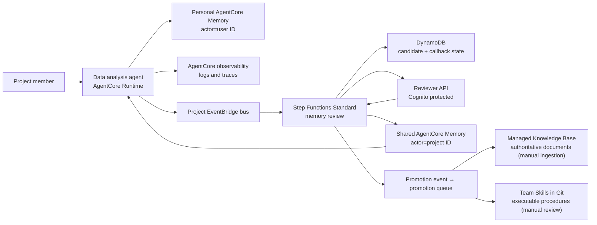

# AgentCore Memory Governance Blueprint

> This is the English translation. The primary document is
> **[README.md](README.md)** (Chinese); where the two differ, the Chinese version
> is authoritative.

When several users share one agent, personal memory stays strictly isolated while
valuable experience becomes team knowledge only after human review. An AWS reference
implementation on Amazon Bedrock AgentCore Memory.

What is scarce in an enterprise is not memory storage but the moment an experience gets
written down. The difficulty with a Knowledge Base or a Skills directory was never storage
or retrieval — it is that **nothing naturally triggers the write**. So what this project
governs is the shared tier's **write boundary**: structured proposal → policy gate → human
review → verbatim storage → attributable and revocable. A Knowledge Base and Skills are not
its competitors; they are downstream of it.

> **Load-bearing limit: memory governance is load-bearing within the memory domain, not
> across the whole agent stack.** Agent effectiveness belongs to an observe → evaluate →
> optimize loop, and governed memory is one input to that loop. Governance optimizes blast
> radius, attributability, and revocability, not single-answer correctness — this project
> makes no claim that governance improves answer quality.

**Start with the results**: [experiment report](docs/实验报告.md) (a real run, 14
checks) · [desktop integration design](docs/desktop-client-integration.md) (how Claude
Code and Codex share one cloud memory)

## Enterprise Governance

The repository also provides a governance layer for enterprise architecture review,
release gates, and audit evidence. The existing README, architecture documents, and
experiment report describe the reference implementation; the documents below turn it
into assignable responsibilities, testable controls, and reproducible experiments:

| Chinese (primary) | English | Purpose |
|---|---|---|
| [企业治理蓝图](docs/ENTERPRISE_GOVERNANCE_BLUEPRINT.md) | [enterprise governance blueprint](docs/ENTERPRISE_GOVERNANCE_BLUEPRINT.en.md) | Multi-account, Region, tenant, identity, network, data, operations, and cross-service contracts |
| [最低控制基线](docs/CONTROL_BASELINE.md) | [control baseline](docs/CONTROL_BASELINE.en.md) | MUST/SHOULD/MAY controls, evidence, release gates, and exception template |
| [跨服务可观测性蓝图](docs/OBSERVABILITY_BLUEPRINT.md) | [observability blueprint](docs/OBSERVABILITY_BLUEPRINT.en.md) | Service telemetry, ADOT/OTEL, experiment evidence, and long-term analytics |
| [企业实验路线](experiments/README.md) | [enterprise experiment path](experiments/README.en.md) | Progressive E00–E07 experiments, negative tests, cost, and cleanup |
| [官方样例目录](docs/AWS_SAMPLE_CATALOG.md) | [AWS sample catalog](docs/AWS_SAMPLE_CATALOG.en.md) | Pinned commit, capability mapping, production gaps, and sample drift |
| [Handoff 报告](HANDOFF_REPORT.md) | [handoff report](HANDOFF_REPORT.en.md) | Unverified assumptions, cross-service alignment, and next ownership |

**Fact snapshot (verified 2026-08-04)**: AgentCore Memory is available in 15 commercial
Regions. Current enterprise-relevant capabilities include long-term record batch CRUD,
indexed and strictly consistent metadata, Kinesis record streaming, control/data
PrivateLink, and stable CDK L2 constructs (see
[Release Notes](https://docs.aws.amazon.com/bedrock-agentcore/latest/devguide/release-notes.html)).
Short-term event retention ranges from 7 to 365 days; the default limit is 150
Memory resources per account per Region and 6 strategies per resource; `CreateEvent`
defaults to 200 TPS, conversational messages are limited to 5 TPS per actor and session,
and `RetrieveMemoryRecords` defaults to 30 TPS. Pricing is USD 0.25 per 1,000 new events;
monthly long-term storage is USD 0.75 per 1,000 records for built-in strategies or USD
0.25 for override/self-managed strategies (plus model usage); retrieval is USD 0.50 per
1,000 calls. Regions, quotas, and prices change, so production decisions must recheck the
official [Region table](https://docs.aws.amazon.com/bedrock-agentcore/latest/devguide/agentcore-regions.html),
[quota page](https://docs.aws.amazon.com/bedrock-agentcore/latest/devguide/bedrock-agentcore-limits.html),
and [pricing page](https://aws.amazon.com/bedrock/agentcore/pricing/).

## What Is Distinctive

Memory is a **governed asset with an authority level**, not a smarter vector store. Three
sentences, none of which depend on a platform (full argument in
[why-layer-by-write-authority](docs/why-layer-by-write-authority.md)): layers are divided by
**who is entitled to change them** rather than by episodic/semantic, which turns conflict
resolution from a semantic judgment into a table lookup; retrieval precedence is a **total
order** carried into the context, replacing "which memories are relevant" (no answer) with
"which authority wins" (one answer); and the shared tier is a **staging area for knowledge
assets** — more governed than a vector store, less friction than authoring a document, and
promoted upward once stable.

The four design judgments below record the implementation trade-offs; reasoning and
counter-evidence in [design rationale](docs/design-rationale.md):

- **Approved text is stored verbatim.** Approval calls
  `BatchCreateMemoryRecords` directly, so `content.text` is the exact string the
  reviewer approved, with no second extraction model rewriting it — what the reviewer
  read is byte-identical to what is stored. Personal preferences work the opposite way:
  `CreateEvent` plus AgentCore strategy extraction, where the wording is model-authored.
- **Six knowledge layers, divided by who is entitled to change them** rather than by
  memory type: logs (observational), short-term memory (raw interaction), personal
  long-term memory (extracted), shared long-term memory (reviewed), Knowledge Base
  (document owner), Skills (Git review). Each layer has a definite writer and a
  definite answer to whether the agent may retrieve it directly — so "may memory
  override a document" has one answer, which an `episodic`/`semantic` taxonomy cannot
  provide.
- **Retrieval precedence is absolute, and travels with the context.** Live data >
  Skills > authoritative documents > reviewed team memory > personal preference, with
  preferences affecting presentation only. This replaces "which memories are relevant"
  with "which authority wins" — the second question has a definite answer, the first
  does not — and it is the only constraint stopping stale memory from overriding
  current data.
- **Human review is the only entrance to shared writes.** Agents and desktop clients
  hold no shared-write permission at the IAM layer; team knowledge can only be proposed.
- **A proposal is a structured contract, not free text.** Every candidate must carry an
  independently understandable statement, one of five `category` values
  (`fact`/`decision`/`constraint`/`incident`/`procedure_hint`), an `evidence_ref`
  pointing at an immutable record (`trace://`/`s3://`/`log://` — a local transcript is
  editable and therefore not evidence), a confidence, and a privacy classification.
  Attribution cannot be forged: `proposer_actor_id` is derived server-side from the
  token's `sub` and any value in the body is ignored. The contract turns "what counts as
  team knowledge" into a checkable shape rather than a convention.

> Review covers the **team tier only**. Personal long-term memory and short-term events
> are not reviewed — IAM bounds their blast radius, but isolation is not review.

## Against the Field

Full comparison, with primary sources and unverified items, in
**[memory-landscape](docs/memory-landscape.md)**.

**Where AgentCore is behind, stated plainly**: retrieval is semantic only — no BM25, no
hybrid, no reranking, and no choice of embedding model — while the factorial study shows
retrieval method is the dominant variable in accuracy (20 points against 3–8 for write
strategy). Invalidation is likewise absent: an AWS blog says consolidation marks outdated
memories `INVALID`, but the API's memory record has no status field and streaming defines
only create/update/delete — **AWS's own blog and API documentation disagree, and this
blueprint follows the API documentation rather than depending on the behaviour**. Zep's
Fact Invalidation is the clear leader on this axis.

**AgentCore's advantages are equally real**: isolation is enforced platform-side through
IAM condition keys such as `bedrock-agentcore:actorId` and `namespace`, whereas scope in
mem0, Zep, Letta, Databricks, Vertex, and Foundry is an application parameter or a
database column — correct code isolates, incorrect code leaks. Databricks documents the
limitation most honestly: "never let the model set it. The app service principal can read
every scope." Add **pre-filtering** metadata (filters applied before the vector search
narrows the candidate set), ten filter operators, `STRICTLY_CONSISTENT` metadata the
application sets without LLM inference, and count-based pricing.

**The amplification is three mutual reinforcements**: pre-filtering puts governance
conditions inside the retrieval path, so unapproved and superseded records never enter the
similarity contest rather than being discarded after scoring; verbatim publication makes
AgentCore's extraction quality irrelevant to the shared tier; and supersession via a
discrete status flag routes around the platform gap without adding the LLM contradiction
adjudicator that the field has shown to be its least reliable component.

**Practical guidance**: choose this for multi-user isolation and accountable team
knowledge; choose mem0 or Zep for retrieval quality or exact keyword matching. The four
layers allow both — the personal tier can change backends while the shared tier keeps IAM
plus review.

## What AWS Documents

Verbatim quotes, implementation line references, and measured evidence per claim:
**[aws-alignment.md](docs/aws-alignment.md)**.

A Well-Architected Lens is a **post-hoc codification of field practice, not a
precondition for it** — patterns reach a Lens after solution architects hit the same
problem repeatedly. So this is not "AWS specified it, we complied." Three distinct
relationships:

**1. Codified by AWS — this repo is a runnable reference**

[AGENTSEC04-BP02 Human-in-the-loop for critical decisions](https://docs.aws.amazon.com/wellarchitected/latest/agentic-ai-lens/agentsec04-bp02.html)
(risk if not established: **High**) reads almost as a specification for this review
pipeline:

| This implementation | AWS verbatim |
|---|---|
| `memory-governance-stack.ts:470` uses `WAIT_FOR_TASK_TOKEN` | "AWS Step Functions **.waitForTaskToken callback pattern introduces an approval step**" |
| `reviewer_api.py:66,87` pops the token before responding | "**Reviewers don't typically call Step Functions APIs directly. The approval app holds the credentials**" |
| `domain.py:101-105` is a pure boolean gate, no model | "**Risk classification itself can't rely on an LLM** exposed to the same untrusted content... Use **deterministic logic**" |
| `evidence_ref` pins an immutable S3 object version | "**Store the full decision context in durable storage such as Amazon S3**" |
| `reviewer_id` and decision timestamp are recorded | "**log human approval decisions with timestamps and reviewer identities**" |

Isolation has official grounding too: the
[Service Authorization Reference](https://docs.aws.amazon.com/service-authorization/latest/reference/list_bedrock-agentcore.html)
confirms `bedrock-agentcore:actorId`, `namespace`, and `sessionId` as IAM condition keys,
and the [GenAI security reference architecture](https://docs.aws.amazon.com/prescriptive-guidance/latest/security-reference-architecture-generative-ai/gen-auto-agents.html)
requires "**Prevent memory poisoning by ensuring that users can't modify their session ID
or actor ID**" — which is why no bridge tool accepts an `actor_id` parameter.

**2. AWS points at it but ships no primitive**

[AGENTSEC01 Secure agent memory and state](https://docs.aws.amazon.com/wellarchitected/latest/agentic-ai-lens/agentsec01.html)
makes "**Memory governance is codified and auditable**" its Level 5 maturity goal. But
AgentCore Memory has **no approval gate on memory writes**, and the Step Functions
integration table lists `.waitForTaskToken` as Not supported for AgentCore — so this
layer must be built. That gap is what this repo implements.

Scoring against that model exposes an **inversion**: Level 5 governance sits on top of
missing Level 3 Guardrails and PII filtering, and missing Level 4 per-read integrity
verification. Governance runs deep; content safety and runtime integrity remain shallow
(see [roadmap](docs/roadmap.md) item 9).

**3. AWS is silent — these are engineering judgements**

Admission control for shared memory (AWS documents shared namespaces, not what qualifies
to enter one), the six-level retrieval precedence order, `versionId`-pinned evidence
provenance, and the Identity Pool session tag plus single shared role combination. No
official source backs these four; they should not be presented as endorsed.

> Two notes on citation discipline: the `INVALID` status appears only in an AWS blog and
> **not in the developer guide or API reference** (see "Against the Field" above) — where
> official sources disagree, this blueprint follows the API documentation. A `strategyId`
> condition key appears in secondary sources but could not be confirmed on the official
> Service Authorization Reference page, so it is not cited.

## Architecture



Two Memory resources, deliberately: `PersonalMemory` is written by the runtime with the
authenticated user ID as actor; `SharedProjectMemory` is writable only by the review
publisher role. Against a single resource plus namespace conventions, the boundary
becomes a resource ARN in IAM rather than a string comparison that must be correct
everywhere.

Three distinct kinds of "event", not interchangeable: **Memory event** (an immutable
conversational event written with `CreateEvent`; short-term, may trigger asynchronous
extraction), **Memory record** (a long-term item, produced by extraction or created
directly with `BatchCreateMemoryRecords`), and **EventBridge domain event** (such as
`memory.candidate.proposed`, which starts governance workflows).

## Repository

- `infra/`: CDK stack — Memory, EventBridge, Step Functions, DynamoDB, Cognito, SNS, reviewer API
- `src/agent/`: runtime adapter that builds source-labelled context
- `src/handlers/`: Lambdas for review registration, callback, decision, publishing, audit state
- `src/blueprint/`: domain model and AgentCore Memory client
- `contracts/`, `skills/`, `tests/`: event contract examples, a team Skill example, local tests

Chinese is the primary language for documentation; English translations are kept in sync.

| Chinese (primary) | English | Content |
|---|---|---|
| [实验报告](docs/实验报告.md) | [scenario-test-report](docs/scenario-test-report.md) | Validated run and 14 check results |
| [桌面客户端集成设计](docs/桌面客户端集成设计.md) | [desktop-client-integration](docs/desktop-client-integration.md) | Desktop identity design, 8 + 17 checks |
| [架构设计](docs/架构设计.md) | [architecture](docs/architecture.md) | Trust boundaries, retrieval precedence, information lifecycle |
| [设计取舍依据](docs/设计取舍依据.md) | [design-rationale](docs/design-rationale.md) | Reasoning behind the distinctive choices, with external evidence |
| [为什么按写入权威分层](docs/为什么按写入权威分层.md) | [why-layer-by-write-authority](docs/why-layer-by-write-authority.md) | The layering argument and its load-bearing limits, with no platform dependency |
| [AWS 官方背书](docs/AWS官方背书.md) | [aws-alignment](docs/aws-alignment.md) | Each claim mapped to AWS documentation, with implementation locations and measured evidence |
| [记忆产品横评](docs/记忆产品横评.md) | [memory-landscape](docs/memory-landscape.md) | AgentCore against mem0/Zep/Letta and the amplification effect |
| [下一步演进](docs/下一步演进.md) | [roadmap](docs/roadmap.md) | Prioritized next evolution, including supersession |
| [演示手册](docs/演示手册.md) | [demo-runbook](docs/demo-runbook.md) | End-to-end demonstration |
| [评估记录](docs/评估记录.md) | [sample-review](docs/sample-review.md) | Findings adopted from official samples, and deferred items |
| [参考资料](docs/参考资料.md) | [references](docs/references.md) | Verified official AWS sources |
| [安全说明](SECURITY.md) | [SECURITY.en](SECURITY.en.md) | Data handling, dependency audit, security boundaries |

`docs/scenario-test-report.md` is generated by `poc/run_demo_scenario.py` with the full
prompts and responses per turn; the Chinese report is the interpreted version.

## Quick Start

```bash
./scripts/install_hooks.sh
python3 -m unittest discover -s tests -v
./poc/build_lambda_layer.sh
cd infra && nvm use && npm install && npm run build && npm test && npx cdk synth
```

`install_hooks.sh` installs a pre-commit hook that verifies the Chinese and English copies
of each document stayed in sync, and rejects the commit when they did not (see
[CLAUDE.md](CLAUDE.md)). Hooks are not cloned with a repository, so run it once per checkout.

`cdk synth` does not call the AWS account. Deployment requires a bootstrapped CDK
environment and permission to create AgentCore Memory resources.

The shared publisher and metadata-filtered retrieval require the SDK version pinned in
`src/requirements.txt` — bundle it into each Lambda artifact or a controlled layer; do
not assume the runtime's preinstalled `boto3` carries the current AgentCore service model.

## Deployment

`projectId` and `environmentName` determine every resource name and are pinned in
`infra/cdk.json` (`analytics-poc` / `demo` for this POC). Changing them makes
CloudFormation replace the whole stack, and retained Memory resources and DynamoDB
tables then block the new stack with `AlreadyExists` — override only for a genuinely
separate environment.

```bash
cd infra
npx cdk deploy \
  -c projectId=analytics-poc \
  -c environmentName=demo \
  -c reviewerOrigin=http://localhost:3000
```

After deployment: create a Cognito reviewer and add them to the reviewer group emitted
by the stack → subscribe to the encrypted SNS topic → configure the runtime from the
stack outputs (event bus name, personal/shared Memory IDs) → propose and approve a
candidate per the [runbook](docs/demo-runbook.md).

The shared Memory's `indexedKeys` are fixed at `CreateMemory` time — they cannot be added
or removed and are not backfilled — and the resource is `RETAIN`. The `superseded_by` key
that supersession needs is therefore declared ahead of use, but an already-deployed
resource does not gain it; only a newly created Memory carries it.

The Knowledge Base ID is an integration parameter, not a resource this stack creates: a
real Knowledge Base needs an explicit source, chunking strategy, vector store, ingestion
job, and retrieval validation, and those decisions should not hide inside a memory demo.

## Scope and Limitations

This is a POC. The boundaries below are deliberate:

- **Personal isolation depends on the path.** The desktop path is IAM-enforced; the
  Runtime role serves every user and relies on application-level actor ownership — the
  most significant open item.
- **The policy gate reads declared labels**, not content; it does not inspect for
  credentials or personal data.
- **The proposal criteria are stated; the trigger is still missing.** The five
  `category` semantics and what should not be proposed are now in the tool description,
  but no hook evaluates a completed turn for anything worth proposing, so proposing
  still depends on the user asking. With no proposals, the governance path idles.
- **Approved facts have no supersession path, and no expiry backstop.** Shared records are
  created directly by `BatchCreateMemoryRecords` with no source event, so
  `eventExpiryDuration` — which applies per event — never reaches them, and
  `MemoryRecordCreateInput` carries no expiry field. A statement that becomes false stays
  retrievable indefinitely, carrying a `review_status=approved` pre-filter label that makes
  it a first-class retrieval result. Record-level removal exists only through an explicit
  `DeleteMemoryRecord` / `BatchDeleteMemoryRecords`.
- **Governance properties are validated; answer quality is not measured.**

Per-item severity: [实验报告](docs/实验报告.md) section 9 and
[桌面客户端集成设计](docs/桌面客户端集成设计.md) section 11; remediation plan:
[roadmap](docs/roadmap.md).
