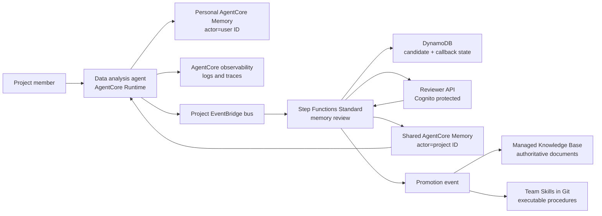

# AgentCore Memory Governance Blueprint

> This is the English translation. The primary document is
> **[README.md](README.md)** (Chinese); where the two differ, the Chinese version
> is authoritative.
>
> 中文文档：**[实验报告](docs/实验报告.md)** · [桌面客户端集成设计](docs/桌面客户端集成设计.md) · [架构设计](docs/架构设计.md) · [设计取舍依据](docs/设计取舍依据.md) · [下一步演进](docs/下一步演进.md) · [演示手册](docs/演示手册.md)

An AWS reference implementation for a multi-user data analysis agent that:

- writes conversation turns to personal AgentCore short-term memory;
- lets AgentCore extract personal preferences into long-term memory;
- proposes project-level memory candidates through EventBridge;
- requires human review before publishing shared project memory;
- keeps logs, memory, Knowledge Bases, and team Skills as separate knowledge layers;
- exposes an auditable promotion path from memory to documents or Skills.

## What Is Distinctive

Memory here is a **governed asset with an authority level**, not a smarter vector
store. The four properties below are not common practice, and each has external
evidence behind it — full argument, including the evidence that cuts the other way,
in **[design rationale](docs/design-rationale.md)**.

**1. Approved text is stored verbatim, with no second LLM extraction pass.**
This is both the governance-correct choice and, counterintuitively, the
performance- and cost-optimal one. An ICLR 2026 factorial study (3 write strategies ×
3 retrieval methods, LoCoMo's 1,540 non-adversarial questions) found that **retrieval
method moves accuracy 20 points (57.1% → 77.2%) while write strategy moves it only
3–8 — and raw chunked storage, with zero LLM calls, matches or outperforms mem0-style
extraction and MemGPT-style summarization**
([arXiv:2603.02473](https://arxiv.org/abs/2603.02473)). The extraction pipeline is the
most expensive, most lossy, least rewarding link in the chain. Corroborating: mem0's
2026 rewrite removed `UPDATE`/`DELETE` from the write path entirely, reverting to a
single append with contradictions coexisting and adjudicated at ranking time — a
product built on write-time adjudication abandoning write-time adjudication.

**2. The four knowledge layers (logs / memory / Knowledge Base / Skills) are divided
by authority.** The prevailing working / episodic / semantic / procedural taxonomy
comes from Tulving 1972 by way of CoALA. A December 2025 survey with 47 authors states
that traditional taxonomies are insufficient for contemporary memory systems and
re-cuts the space by forms (token / parametric / latent) × functions × dynamics
([arXiv:2512.13564](https://arxiv.org/abs/2512.13564)). Dividing by **authority**
matters because authority is an operational property — it determines who may write and
what overrides what. "Episodic" only classifies.

**3. Retrieval precedence is absolute, and travels with the context.**
Live data > Skills > authoritative documents > reviewed team memory > personal
preference > model inference, with preferences allowed to affect presentation only.
This targets three named failure modes: **experience following** (an agent reproduces
the quality of whatever it retrieves, errors included); **lost-in-the-middle**
(mid-context evidence is recovered markedly less reliably,
[Liu et al., TACL 2024](https://arxiv.org/abs/2307.03172)); and **context rot**, which
is worst when distractors are semantically close to the answer — the defining
characteristic of a memory store, since memory is retrieved *because* it is similar.
So "memory never overrides live data" is not fastidiousness; it is the structural
constraint that stops stale memory from contaminating a current judgment. In
implementation, `src/agent/context_builder.py` puts `conflict_rule` and the precedence
order into the prompt together with a citation envelope (record ID, namespaces, score,
strategy ID) — precedence is an explicit instruction, not a convention in a document.

**4. The human review gate is a currently scarce anti-poisoning control.**
Not a theoretical risk. **MINJA** writes malicious records into a memory bank through
ordinary conversation alone, with no database access, and guard models, embedding
sanitization, and prompt-based detection **all fail against it**
([arXiv:2503.03704](https://arxiv.org/abs/2503.03704), NeurIPS 2025). Publicly
reported incidents include SpAIware, LayerX's "Tainted Memories", and Radware's
"ZombieAgent". Most on point is **MemoryTrap** — reported and remediated against
Claude Code, where one poisoned memory object propagated across sessions, users, and
subagents
([Help Net Security](https://www.helpnetsecurity.com/2026/04/14/idan-habler-cisco-agentic-ai-memory-attacks/)).
This blueprint is precisely about Claude Code and Codex sharing one cloud memory,
which is the direct justification for gating the shared write path.

> **The scope must be stated plainly: review covers the team tier only.** Personal
> long-term memory is written by AgentCore extraction and short-term events are written
> directly; neither is reviewed, so MemoryTrap-style propagation remains applicable
> there. IAM confines a personal record's blast radius to one actor — but that is
> isolation, not review.

These properties are verified end to end against a real deployment: the
[experiment report](docs/实验报告.md) (14 checks) and the
[desktop integration design](docs/桌面客户端集成设计.md) (8 + 17 checks, including a
**mirror test** in which Alice's and Bob's permissions invert under the same role,
ruling out a policy that merely happens to be hardcoded). Known gaps and planned work,
including evidence immutability that is still unenforced and the self-approval path:
**[roadmap](docs/roadmap.md)**.

## Architecture



The blueprint deliberately uses **two Memory resources**:

1. `PersonalMemory` is written by the agent runtime. Its actor is the authenticated
   user ID and its strategies extract user preferences and session summaries.
2. `SharedProjectMemory` is written only by the review publisher role. Approval
   directly creates a long-term record in a project namespace, so reviewed text is
   not changed by another extraction model.

This is a stronger isolation boundary than putting personal and shared records into
one resource and relying only on namespace conventions.

## Repository

- `infra/`: AWS CDK stack for Memory, EventBridge, Step Functions, DynamoDB,
  Cognito, SNS, and the reviewer API.
- `src/agent/`: adapter called by an AgentCore-hosted agent after a completed turn.
  It also builds source-labelled context from Knowledge Base, shared memory, and
  personal preferences.
- `src/handlers/`: Lambda handlers for review registration, callback, decision,
  publishing, and audit state.
- `src/blueprint/`: shared domain and AgentCore Memory client code.
- `contracts/`: example EventBridge event contracts.
- `skills/`: an example team Skill showing the final promotion target.
- `tests/`: local tests that do not require an AWS account.

Chinese is the primary language for documentation; English translations are kept in
sync.

| Chinese (primary) | English | Content |
|---|---|---|
| [实验报告](docs/实验报告.md) | [scenario-test-report](docs/scenario-test-report.md) | Validated run of the governance properties, 14 checks |
| [桌面客户端集成设计](docs/桌面客户端集成设计.md) | — | Desktop identity design, 8 + 17 checks |
| [架构设计](docs/架构设计.md) | [architecture](docs/architecture.md) | Trust boundaries, retrieval precedence, information lifecycle |
| [设计取舍依据](docs/设计取舍依据.md) | [design-rationale](docs/design-rationale.md) | Why the distinctive choices were made, with external evidence |
| [下一步演进](docs/下一步演进.md) | [roadmap](docs/roadmap.md) | Prioritized next evolution, including supersession semantics |
| [演示手册](docs/演示手册.md) | [demo-runbook](docs/demo-runbook.md) | End-to-end demonstration |
| [评估记录](docs/评估记录.md) | [sample-review](docs/sample-review.md) | Findings adopted from official samples, and deferred patterns |
| [参考资料](docs/参考资料.md) | [references](docs/references.md) | Verified official AWS sources |
| [安全说明](SECURITY.md) | [SECURITY.en](SECURITY.en.md) | Data handling, dependency audit, security boundaries |

`docs/scenario-test-report.md` is generated by `poc/run_demo_scenario.py` and contains
the full prompts and responses for each turn; the Chinese report is the interpreted
version.

## Event Terminology

There are two different event types:

- **AgentCore Memory event**: an immutable conversational event written with
  `CreateEvent`; it is short-term memory and can trigger asynchronous extraction.
- **AgentCore Memory record**: a long-term item created by extraction or directly
  with `BatchCreateMemoryRecords`.
- **EventBridge domain event**: a routing envelope such as
  `memory.candidate.proposed`; it starts governance workflows.

They are intentionally not interchangeable.

## Quick Start

```bash
python3 -m unittest discover -s tests -v
./poc/build_lambda_layer.sh
cd infra
nvm use
npm install
npm run build
npm test
npx cdk synth
```

`cdk synth` does not call the AWS account. Deployment requires a bootstrapped CDK
environment and permissions to create AgentCore Memory resources.

The shared publisher and metadata-filtered retrieval require the SDK version in
`src/requirements.txt`. Bundle it into each Lambda artifact or a controlled Lambda
layer; do not assume the Python runtime's preinstalled `boto3` has the current
AgentCore service model.

## Deployment Inputs

`projectId` and `environmentName` determine every resource name. They are pinned in
`infra/cdk.json` (`analytics-poc` / `demo` for this POC) and the synth fails if either
is missing. Changing them makes CloudFormation replace the whole stack — retained
Memory resources and DynamoDB tables then block the new stack with `AlreadyExists`, so
override them only when deploying a genuinely separate environment.

```bash
cd infra
npx cdk deploy \
  -c projectId=analytics-poc \
  -c environmentName=demo \
  -c reviewerOrigin=http://localhost:3000
```

After deployment:

1. Create a Cognito reviewer user and add it to the project-specific reviewer group
   emitted by the stack.
2. Subscribe a reviewer to the encrypted SNS topic.
3. Configure the agent runtime with the stack outputs for event bus name and
   personal/shared Memory IDs.
4. Use the runbook to publish a candidate and approve it.

The Knowledge Base ID is an integration parameter rather than a resource created by
this stack. A real Knowledge Base needs an explicit source, chunking strategy, vector
store, ingestion job, and retrieval validation; those decisions should not be hidden
inside a memory demo.

## Scope and Limitations

This is a POC. The boundaries below are deliberate; treating them as production-ready
would misrepresent what has been validated.

- **Review covers the shared tier only.** Personal long-term memory is written by
  AgentCore extraction with no review step. "Memory is reviewed" is true of team
  knowledge, not of personal preferences.
- **Personal isolation depends on which path is used.** The desktop path enforces it
  in IAM. The AgentCore Runtime role serves every user and therefore relies on
  application-level actor ownership — the most significant open item.
- **The policy gate reads declared labels.** It checks a self-reported privacy
  classification and confidence score; it does not inspect content for credentials
  or personal data.
- **Approved facts have no supersession path.** A statement that later becomes false
  stays retrievable until the resource expiry.
- **Governance properties are validated; answer quality is not measured.** No claim
  is made that memory improves output quality.

Full per-item severity tables: [实验报告](docs/实验报告.md) section 9 and
[桌面客户端集成设计](docs/桌面客户端集成设计.md) section 11. Planned remediation in
priority order: [roadmap](docs/roadmap.md).
