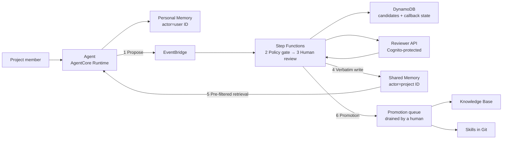

# AgentCore Shared Memory Governance Blueprint

> This is the English translation. The primary document is
> **[README.md](README.md)** (Chinese); where the two differ, the Chinese version
> is authoritative.

When several users share one agent, personal memory stays strictly isolated while
valuable experience becomes team knowledge only after human review. An AWS reference
implementation on Amazon Bedrock AgentCore Memory.

**What is scarce in an enterprise is not memory storage but the moment an experience gets
written down.** The difficulty with a Knowledge Base or a Skills directory was never storage
or retrieval — it is that nothing naturally triggers the write. So what this project governs
is the shared tier's **write boundary**, and a Knowledge Base and Skills are not its
competitors; they are downstream of it.

**Start with the results**: [experiment report](docs/实验报告.md) (a real run, 14 checks) ·
[runbook](docs/demo-runbook.md) (run it end to end)

## The shared-memory pipeline

An experience takes six steps to go from being said aloud to being team knowledge. Each step
has a definite writer, a definite location in the code, and one checkable official source.



| Step | What happens | Code | Official source |
|---|---|---|---|
| 1 **Propose** | The agent can only propose; it cannot write the shared tier. A candidate is a structured contract: statement, one of five `category` values, an `evidence_ref` pointing at an immutable record, a confidence, and a privacy classification | `bridge/server.py:322` (`memory_propose_shared`), `src/blueprint/domain.py:27` | [1. Human review is the only path into shared memory](docs/aws-alignment.md#1-human-review-is-the-only-path-into-shared-memory), [3. Isolation by actorId and namespace](docs/aws-alignment.md#3-isolation-by-actorid-and-namespace-enforced-by-iam) |
| 2 **Policy gate** | A pure boolean decision with no model involved: `privacy_classification != "restricted" and confidence >= 0.70` | `src/blueprint/domain.py:103` | [2. The policy gate uses deterministic rules, not an LLM](docs/aws-alignment.md#2-the-policy-gate-uses-deterministic-rules-not-an-llm) |
| 3 **Human review** | Step Functions suspends on `WAIT_FOR_TASK_TOKEN`; the reviewer API `pop`s the token before returning, so it is single-use | `infra/lib/memory-governance-stack.ts:503`, `src/handlers/reviewer_api.py:68` | [1. Human review is the only path into shared memory](docs/aws-alignment.md#1-human-review-is-the-only-path-into-shared-memory) |
| 4 **Verbatim write** | `BatchCreateMemoryRecords` writes the long-term record directly, so `content.text` is the exact string the reviewer approved, with no second model rewriting it | `src/blueprint/memory.py:56` | [5. Verbatim publication: approved text is stored as approved](docs/aws-alignment.md#5-verbatim-publication-approved-text-is-stored-as-approved) |
| 5 **Pre-filtered retrieval** | Filters on `review_status = approved` **before** the vector search narrows the candidate set — unapproved records never enter the similarity contest | `src/agent/context_builder.py:135` | [4. Memory is not authoritative truth and must not override current data](docs/aws-alignment.md#4-memory-is-not-authoritative-truth-and-must-not-override-current-data) |
| 6 **Promotion** | On approval with a `promotion_hint`, a domain event is routed to a KMS-encrypted queue that a human drains | `src/handlers/mark_status.py:52`, `infra/lib/memory-governance-stack.ts:389` | [What AWS does not cover](docs/aws-alignment.md#what-aws-does-not-cover) — an engineering judgment |

The verbatim quote, implementation reference, and measured evidence behind each source are in
**[aws-alignment](docs/aws-alignment.md)**, which also lists what is
[not citable as an AWS position](docs/aws-alignment.md#not-citable-as-an-aws-position).

**Two Memory resources is deliberate**: `PersonalMemory` is written by the runtime with the
authenticated user ID as the actor; `SharedProjectMemory` accepts writes only from the
review-publisher role. Compared with one resource plus a namespace convention, the boundary
becomes a resource ARN in IAM rather than a string comparison that must be correct
everywhere.

> Three distinct things are called "events" and must not be conflated: a **Memory event**
> (the immutable conversational event written by `CreateEvent`, short-term memory), a
> **Memory record** (a long-term entry, produced by extraction or created directly by
> `BatchCreateMemoryRecords`), and an **EventBridge domain event** (such as
> `memory.candidate.proposed`, which starts the governance workflow).

## Why layer it this way

Memory is a **governed asset with an authority level**, not a smarter vector store. Three
sentences, none of which depend on a platform (the full argument is in
**[why-layer-by-write-authority](docs/why-layer-by-write-authority.md)**):

- Layers are divided by **who is entitled to change them** rather than by
  episodic/semantic — which turns conflict resolution from a semantic judgment into a table
  lookup, and a lookup can happen before retrieval, with no model involved.
- Retrieval precedence is a **total order** carried into the context: live data > Skills >
  authoritative documents > reviewed team memory > personal preference. This replaces "which
  memories are relevant" (no answer) with "which authority wins" (one answer).
- The shared tier is a **staging area for knowledge assets**: more governed than a vector
  store, less friction than authoring a document, promoted upward once stable.

Reasoning and counter-evidence for each trade-off are in
**[design-rationale](docs/design-rationale.md)**; trust boundaries and the information
lifecycle are in **[architecture](docs/architecture.md)**.

> Review covers the **team tier only**. Personal long-term memory and short-term events
> are not reviewed — IAM bounds their blast radius, but isolation is not review.

## Scope and limitations

This is a POC. The boundaries below are deliberate:

- **Personal isolation depends on the path.** The desktop path is IAM-enforced; the Runtime
  role serves every user and relies on application-level actor ownership — the most
  significant open item.
- **The policy gate reads declared labels**, not content; it does not inspect for
  credentials or personal data.
- **The proposal criteria are stated; the trigger is still missing.** No hook evaluates a
  completed turn for anything worth proposing, so proposing still depends on the user
  asking. With no proposals, the governance path idles.
- **Approved facts have no supersession path, and no expiry backstop.** Shared records are
  created directly by `BatchCreateMemoryRecords` with no source event, so
  `eventExpiryDuration` — which applies per event — never reaches them, and
  `MemoryRecordCreateInput` carries no expiry field. A statement that becomes false stays
  retrievable indefinitely, carrying a `review_status=approved` label that makes it a
  first-class retrieval result.
- **The gate cannot deduplicate.** Two of the four shared records in the run are the same
  sentence, scoring an identical 0.6626 ([experiment report](docs/实验报告.md) check 13). A
  gate judges whether a statement qualifies, not whether the tier already holds it.
- **Governance properties are validated; answer quality is not measured.** Governance
  optimizes blast radius, attributability, and revocability, not single-answer correctness.
  Whether the shared tier repays its cost turns on shared hit rate and repeat-question rate;
  `src/agent/context_builder.py` now logs both signals and
  `poc/analyze_retrieval_metrics.py` aggregates them, but there are not yet enough runs to
  report either number.

The remediation plan and its priorities are in **[roadmap](docs/roadmap.md)**; external
research and four rebuttals that must be answered are in
**[positioning-analysis](docs/positioning-analysis.md)**.

## Quick start

```bash
./scripts/install_hooks.sh
python3 -m unittest discover -s tests -v
./poc/build_lambda_layer.sh
cd infra && nvm use && npm install && npm run build && npm test && npx cdk synth
```

`cdk synth` does not call an AWS account. `install_hooks.sh` installs a pre-commit hook that
checks whether each bilingual pair is in sync (see [CLAUDE.md](CLAUDE.md)); hooks are not
cloned with a repository, so each checkout installs it once.

The shared-memory publisher and metadata-filtered retrieval depend on the SDK version pinned
in `src/requirements.txt` — bundle it into the Lambda artifact or a controlled layer rather
than assuming the runtime's preinstalled `boto3` carries the current AgentCore service model.

## Deployment

```bash
cd infra
npx cdk deploy \
  -c projectId=analytics-poc \
  -c environmentName=demo \
  -c reviewerOrigin=http://localhost:3000
```

`projectId` and `environmentName` determine every resource name and are fixed in
`infra/cdk.json`. Changing them makes CloudFormation replace the whole stack, and the
retained Memory resources and DynamoDB tables then block the new stack with
`AlreadyExists` — override them only when deploying a genuinely separate environment.

After deployment: create a Cognito reviewer and add them to the reviewer group emitted by the
stack → subscribe to the encrypted SNS topic → configure the runtime from the stack outputs
(event bus name, personal/shared Memory IDs) → propose and approve a candidate per the
[runbook](docs/demo-runbook.md).

The Knowledge Base ID is an integration parameter, not a resource this stack creates: a real
Knowledge Base needs an explicit source, chunking strategy, vector store, ingestion job, and
retrieval validation, and those decisions should not hide inside a memory demo.

## Repository

- `infra/`: the CDK stack — Memory, EventBridge, Step Functions, DynamoDB, Cognito, SNS, reviewer API
- `src/agent/`: the runtime adapter that builds context with source attribution
- `src/handlers/`: Lambdas for review registration, callback, decision, publication, audit status
- `src/blueprint/`: the domain model and the AgentCore Memory client
- `bridge/`: the desktop MCP service (the proposal entrance for Claude Code / Codex)
- `contracts/`, `skills/`, `tests/`: event contract samples, a team Skill sample, local tests

## Appendix

### All documents

| Chinese (primary) | English | Contents |
|---|---|---|
| [实验报告](docs/实验报告.md) | [scenario-test-report](docs/scenario-test-report.md) | The measured run and the results of 14 checks |
| [架构设计](docs/架构设计.md) | [architecture](docs/architecture.md) | Trust boundaries, retrieval precedence, information lifecycle |
| [设计取舍依据](docs/设计取舍依据.md) | [design-rationale](docs/design-rationale.md) | Reasoning and external evidence behind the core judgments |
| [为什么按写入权威分层](docs/为什么按写入权威分层.md) | [why-layer-by-write-authority](docs/why-layer-by-write-authority.md) | The layering argument and its load-bearing limits, with no platform dependency |
| [AWS 官方背书](docs/AWS官方背书.md) | [aws-alignment](docs/aws-alignment.md) | Each claim aligned to AWS documentation, with implementation references and measured evidence |
| [下一步演进](docs/下一步演进.md) | [roadmap](docs/roadmap.md) | Prioritised evolution items, including supersession semantics and the capture-entrance design |
| [定位分析](docs/定位分析.md) | [positioning-analysis](docs/positioning-analysis.md) | External research notes: where the differentiation lies, four rebuttals to answer, and an unciteable list |
| [桌面客户端集成设计](docs/桌面客户端集成设计.md) | [desktop-client-integration](docs/desktop-client-integration.md) | The desktop identity design and 8 + 17 measured checks |
| [演示手册](docs/演示手册.md) | [demo-runbook](docs/demo-runbook.md) | The end-to-end demonstration |
| [评估记录](docs/评估记录.md) | [sample-review](docs/sample-review.md) | What was adopted from the official samples, and what was deferred |
| [参考资料](docs/参考资料.md) | [references](docs/references.md) | Verified AWS sources |
| [安全说明](SECURITY.md) | [SECURITY.en](SECURITY.en.md) | Data handling, dependency audit, security boundaries |

`docs/scenario-test-report.md` is generated by `poc/run_demo_scenario.py` and contains the
full prompt and answer for every turn; the Chinese version is a hand-written interpretation
of it.

### Enterprise adoption extension

A general methodology for enterprise architecture review, release gates, and audit evidence.
It sits on a different axis from the shared-memory pipeline — it covers multi-account setups,
responsibility boundaries, control baselines, and progressive experiments — so it is grouped
separately:

| Chinese (primary) | English | Purpose |
|---|---|---|
| [企业治理蓝图](docs/ENTERPRISE_GOVERNANCE_BLUEPRINT.md) | [enterprise governance blueprint](docs/ENTERPRISE_GOVERNANCE_BLUEPRINT.en.md) | Multi-account, Region, tenant, identity, network, data, operations, and cross-service contracts |
| [最低控制基线](docs/CONTROL_BASELINE.md) | [control baseline](docs/CONTROL_BASELINE.en.md) | MUST/SHOULD/MAY controls, evidence, release gates, and exception template |
| [跨服务可观测性蓝图](docs/OBSERVABILITY_BLUEPRINT.md) | [observability blueprint](docs/OBSERVABILITY_BLUEPRINT.en.md) | Service telemetry, ADOT/OTEL, experiment evidence, and long-term analytics |
| [企业实验路线](experiments/README.md) | [enterprise experiment path](experiments/README.en.md) | Progressive E00–E07 experiments, negative tests, cost, and cleanup |
| [官方样例目录](docs/AWS_SAMPLE_CATALOG.md) | [AWS sample catalog](docs/AWS_SAMPLE_CATALOG.en.md) | Pinned commit, capability mapping, production gaps, and sample drift |

### Platform fact snapshot (rechecked 2026-08-18)

These numbers change; production decisions must recheck the official
[Region table](https://docs.aws.amazon.com/bedrock-agentcore/latest/devguide/agentcore-regions.html),
[quota page](https://docs.aws.amazon.com/bedrock-agentcore/latest/devguide/bedrock-agentcore-limits.html),
and [pricing page](https://aws.amazon.com/bedrock/agentcore/pricing/).

- **Availability**: AgentCore Memory is available in 15 commercial Regions plus GovCloud
  (US-West).
- **Quotas**: 150 Memory resources per account per Region, 6 strategies per resource, at most
  10 indexed keys per Memory; `CreateEvent` at 200 TPS and 5 TPS per actor and session;
  short-term event retention from 7 to 365 days.
- **Pricing**: USD 0.25 per 1,000 new events; monthly long-term storage at USD 0.75 per 1,000
  records for built-in strategies or USD 0.25 for override/self-managed strategies (model
  usage billed separately); USD 0.50 per 1,000 retrievals.
- **Indexed keys**: they can be added later (`UpdateMemory` with `--add-indexed-keys`) but
  **never removed, and adding one does not backfill** — only records written or updated after
  the key exists are indexed for it. The `superseded_by` key that supersession needs is
  therefore already declared; an already-deployed resource needs one `UpdateMemory` call to
  gain it, since `cdk deploy` will not replace a `RETAIN`ed Memory.
- **A disagreement between official sources**: the `INVALID` memory status appears only in an
  AWS blog and **not in the API reference** — `MemoryRecord` carries only
  `content`/`createdAt`/`memoryRecordId`/`memoryStrategyId`/`namespaces`/`metadata`, with no
  status field. Where official sources disagree, this blueprint follows the API documentation
  and does not depend on the behaviour.
