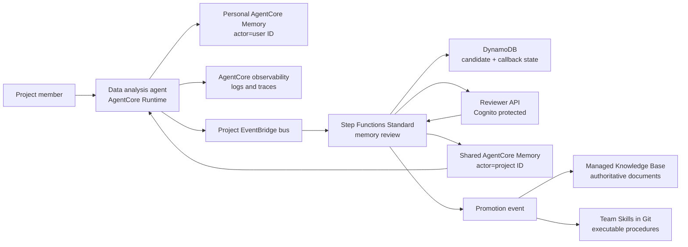

# AgentCore Memory Governance Blueprint

> This is the English translation. The primary document is
> **[README.md](README.md)** (Chinese); where the two differ, the Chinese version
> is authoritative.

When several users share one agent, personal memory stays strictly isolated while
valuable experience becomes team knowledge only after human review. An AWS reference
implementation on Amazon Bedrock AgentCore Memory.

**Start with the results**: [experiment report](docs/实验报告.md) (a real run, 14
checks) · [desktop integration design](docs/桌面客户端集成设计.md) (how Claude Code and
Codex share one cloud memory)

## What Is Distinctive

Memory is a **governed asset with an authority level**, not a smarter vector store.
Four design judgments; reasoning and counter-evidence in
[design rationale](docs/design-rationale.md):

- **Approved text is stored verbatim.** Approval calls
  `BatchCreateMemoryRecords` directly, so `content.text` is the exact string the
  reviewer approved, with no second extraction model rewriting it — what the reviewer
  read is byte-identical to what is stored. Personal preferences work the opposite way:
  `CreateEvent` plus AgentCore strategy extraction, where the wording is model-authored.
- **Six knowledge layers, divided by who is entitled to change them** rather than by
  memory type: logs (observational), short-term memory (raw interaction), personal
  long-term memory (extracted), shared long-term memory (reviewed), Knowledge Base
  (document owner), Skills (Git review). Each layer has a definite writer and a
  definite answer to whether the agent may retrieve it directly — so "may memory
  override a document" has one answer, which an `episodic`/`semantic` taxonomy cannot
  provide.
- **Retrieval precedence is absolute, and travels with the context.** Live data >
  Skills > authoritative documents > reviewed team memory > personal preference, with
  preferences affecting presentation only. This replaces "which memories are relevant"
  with "which authority wins" — the second question has a definite answer, the first
  does not — and it is the only constraint stopping stale memory from overriding
  current data.
- **Human review is the only entrance to shared writes.** Agents and desktop clients
  hold no shared-write permission at the IAM layer; team knowledge can only be proposed.
- **A proposal is a structured contract, not free text.** Every candidate must carry an
  independently understandable statement, one of five `category` values
  (`fact`/`decision`/`constraint`/`incident`/`procedure_hint`), an `evidence_ref`
  pointing at an immutable record (`trace://`/`s3://`/`log://` — a local transcript is
  editable and therefore not evidence), a confidence, and a privacy classification.
  Attribution cannot be forged: `proposer_actor_id` is derived server-side from the
  token's `sub` and any value in the body is ignored. The contract turns "what counts as
  team knowledge" into a checkable shape rather than a convention.

> Review covers the **team tier only**. Personal long-term memory and short-term events
> are not reviewed — IAM bounds their blast radius, but isolation is not review.

## Architecture



Two Memory resources, deliberately: `PersonalMemory` is written by the runtime with the
authenticated user ID as actor; `SharedProjectMemory` is writable only by the review
publisher role. Against a single resource plus namespace conventions, the boundary
becomes a resource ARN in IAM rather than a string comparison that must be correct
everywhere.

Three distinct kinds of "event", not interchangeable: **Memory event** (an immutable
conversational event written with `CreateEvent`; short-term, may trigger asynchronous
extraction), **Memory record** (a long-term item, produced by extraction or created
directly with `BatchCreateMemoryRecords`), and **EventBridge domain event** (such as
`memory.candidate.proposed`, which starts governance workflows).

## Repository

- `infra/`: CDK stack — Memory, EventBridge, Step Functions, DynamoDB, Cognito, SNS, reviewer API
- `src/agent/`: runtime adapter that builds source-labelled context
- `src/handlers/`: Lambdas for review registration, callback, decision, publishing, audit state
- `src/blueprint/`: domain model and AgentCore Memory client
- `contracts/`, `skills/`, `tests/`: event contract examples, a team Skill example, local tests

Chinese is the primary language for documentation; English translations are kept in sync.

| Chinese (primary) | English | Content |
|---|---|---|
| [实验报告](docs/实验报告.md) | [scenario-test-report](docs/scenario-test-report.md) | Validated run and 14 check results |
| [桌面客户端集成设计](docs/桌面客户端集成设计.md) | — | Desktop identity design, 8 + 17 checks |
| [架构设计](docs/架构设计.md) | [architecture](docs/architecture.md) | Trust boundaries, retrieval precedence, information lifecycle |
| [设计取舍依据](docs/设计取舍依据.md) | [design-rationale](docs/design-rationale.md) | Reasoning behind the distinctive choices, with external evidence |
| [下一步演进](docs/下一步演进.md) | [roadmap](docs/roadmap.md) | Prioritized next evolution, including supersession |
| [演示手册](docs/演示手册.md) | [demo-runbook](docs/demo-runbook.md) | End-to-end demonstration |
| [评估记录](docs/评估记录.md) | [sample-review](docs/sample-review.md) | Findings adopted from official samples, and deferred items |
| [参考资料](docs/参考资料.md) | [references](docs/references.md) | Verified official AWS sources |
| [安全说明](SECURITY.md) | [SECURITY.en](SECURITY.en.md) | Data handling, dependency audit, security boundaries |

`docs/scenario-test-report.md` is generated by `poc/run_demo_scenario.py` with the full
prompts and responses per turn; the Chinese report is the interpreted version.

## Quick Start

```bash
python3 -m unittest discover -s tests -v
./poc/build_lambda_layer.sh
cd infra && nvm use && npm install && npm run build && npm test && npx cdk synth
```

`cdk synth` does not call the AWS account. Deployment requires a bootstrapped CDK
environment and permission to create AgentCore Memory resources.

The shared publisher and metadata-filtered retrieval require the SDK version pinned in
`src/requirements.txt` — bundle it into each Lambda artifact or a controlled layer; do
not assume the runtime's preinstalled `boto3` carries the current AgentCore service model.

## Deployment

`projectId` and `environmentName` determine every resource name and are pinned in
`infra/cdk.json` (`analytics-poc` / `demo` for this POC). Changing them makes
CloudFormation replace the whole stack, and retained Memory resources and DynamoDB
tables then block the new stack with `AlreadyExists` — override only for a genuinely
separate environment.

```bash
cd infra
npx cdk deploy \
  -c projectId=analytics-poc \
  -c environmentName=demo \
  -c reviewerOrigin=http://localhost:3000
```

After deployment: create a Cognito reviewer and add them to the reviewer group emitted
by the stack → subscribe to the encrypted SNS topic → configure the runtime from the
stack outputs (event bus name, personal/shared Memory IDs) → propose and approve a
candidate per the [runbook](docs/demo-runbook.md).

The Knowledge Base ID is an integration parameter, not a resource this stack creates: a
real Knowledge Base needs an explicit source, chunking strategy, vector store, ingestion
job, and retrieval validation, and those decisions should not hide inside a memory demo.

## Scope and Limitations

This is a POC. The boundaries below are deliberate:

- **Personal isolation depends on the path.** The desktop path is IAM-enforced; the
  Runtime role serves every user and relies on application-level actor ownership — the
  most significant open item.
- **The policy gate reads declared labels**, not content; it does not inspect for
  credentials or personal data.
- **The proposal criteria are stated; the trigger is still missing.** The five
  `category` semantics and what should not be proposed are now in the tool description,
  but no hook evaluates a completed turn for anything worth proposing, so proposing
  still depends on the user asking. With no proposals, the governance path idles.
- **Approved facts have no supersession path**; a statement that becomes false stays
  retrievable until the resource expiry.
- **Governance properties are validated; answer quality is not measured.**

Per-item severity: [实验报告](docs/实验报告.md) section 9 and
[桌面客户端集成设计](docs/桌面客户端集成设计.md) section 11; remediation plan:
[roadmap](docs/roadmap.md).
