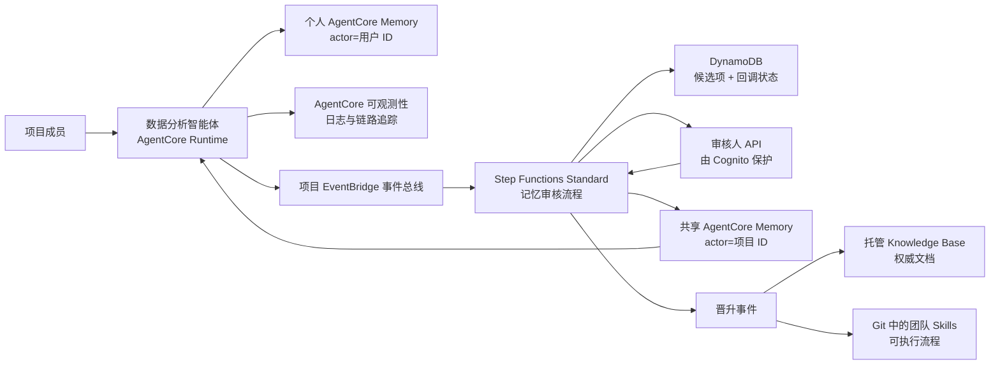

# AgentCore 记忆治理蓝图

> 本文档为主版本。English: **[README.en.md](README.en.md)**。

多用户共用一个智能体（agent）时，个人记忆严格隔离，而有价值的经验经人工审核后成为团队
共享知识。基于 Amazon Bedrock AgentCore Memory 的 AWS 参考实现。

**想先看结论**：[实验报告](docs/实验报告.md)（真实运行 + 14 项检查）·
[桌面客户端集成设计](docs/桌面客户端集成设计.md)（Claude Code / Codex 如何共用云端记忆）

## 核心特点

记忆是**带权威等级的受治理资产**，不是一个更聪明的向量库。四条设计判断，依据与反向证据
见[设计取舍依据](docs/设计取舍依据.md)：

- **批准原文逐字入库。** 审核通过后走 `BatchCreateMemoryRecords` 直接写入长期记录，
  `content.text` 就是审核员批准的那段字符串本身，不经第二次模型抽取改写 —— 因此
  「审核员看到的」与「库里存的」逐字节相同。个人偏好则相反，走 `CreateEvent` +
  AgentCore 策略抽取，措辞由模型重写。
- **知识分层按「权威」划分**，而非认知科学词汇。权威能推导出谁能写、谁能覆盖谁。
- **检索优先级是铁律。** 实时数据 > Skills > 权威文档 > 已审团队记忆 > 个人偏好。
  记忆永不覆盖当前数据。
- **人工审核是共享写入的唯一入口。** 智能体与桌面客户端在 IAM 层就不持有共享写权限，
  团队知识只能提案。

> 审核只覆盖**团队层**。个人长期记忆与短期事件无审核环节 —— IAM 限制其爆炸半径，
> 但隔离不等于审核。

## 架构



刻意使用**两个 Memory 资源**：`PersonalMemory` 由运行时写入，actor 为已认证用户 ID；
`SharedProjectMemory` 只允许审核发布角色写入。相比单资源 + 命名空间（namespace）约定，
边界可表达为 IAM 里的资源 ARN，而非处处正确的字符串比较。

术语上区分三类「事件」，不可混用：**Memory event**（`CreateEvent` 写入的不可变对话事件，
属短期记忆，可触发异步抽取）、**Memory record**（长期条目，由抽取生成或
`BatchCreateMemoryRecords` 直接创建）、**EventBridge 领域事件**（如
`memory.candidate.proposed`，用于启动治理工作流）。

## 代码仓库结构

- `infra/`：CDK 堆栈 —— Memory、EventBridge、Step Functions、DynamoDB、Cognito、SNS、审核人 API
- `src/agent/`：运行时适配层，构建带来源标注的上下文
- `src/handlers/`：审核注册、回调、决策、发布、审计状态的 Lambda
- `src/blueprint/`：领域模型与 AgentCore Memory 客户端
- `contracts/`、`skills/`、`tests/`：事件契约示例、团队 Skill 示例、本地测试

文档以中文为主版本，英文版同步维护：

| 中文（主） | English | 内容 |
|---|---|---|
| [实验报告](docs/实验报告.md) | [scenario-test-report](docs/scenario-test-report.md) | 真实实测过程与 14 项检查结果 |
| [桌面客户端集成设计](docs/桌面客户端集成设计.md) | — | 桌面端身份方案与 8 + 17 项实测 |
| [架构设计](docs/架构设计.md) | [architecture](docs/architecture.md) | 信任边界、检索优先级、信息生命周期 |
| [设计取舍依据](docs/设计取舍依据.md) | [design-rationale](docs/design-rationale.md) | 核心特点的取舍理由与外部证据 |
| [下一步演进](docs/下一步演进.md) | [roadmap](docs/roadmap.md) | 按优先级排列的演进项，含取代语义 |
| [演示手册](docs/演示手册.md) | [demo-runbook](docs/demo-runbook.md) | 端到端演示流程 |
| [评估记录](docs/评估记录.md) | [sample-review](docs/sample-review.md) | 官方示例的吸收结论与推迟项 |
| [参考资料](docs/参考资料.md) | [references](docs/references.md) | 已核验的 AWS 官方资料 |
| [安全说明](SECURITY.md) | [SECURITY.en](SECURITY.en.md) | 数据处理、依赖审计、安全边界 |

`docs/scenario-test-report.md` 由 `poc/run_demo_scenario.py` 自动生成，含每轮完整 prompt
与回答；中文版为其解读版本。

## 快速开始

```bash
python3 -m unittest discover -s tests -v
./poc/build_lambda_layer.sh
cd infra && nvm use && npm install && npm run build && npm test && npx cdk synth
```

`cdk synth` 不调用 AWS 账号。部署需已 bootstrap 的 CDK 环境与创建 AgentCore Memory 的权限。

共享记忆发布器和元数据过滤检索依赖 `src/requirements.txt` 指定的 SDK 版本 —— 请打包进
Lambda 制品或受控 layer，不要假设运行时预装的 `boto3` 含当前 AgentCore 服务模型。

## 部署

`projectId` 与 `environmentName` 决定所有资源名称，在 `infra/cdk.json` 中固定
（本 POC 为 `analytics-poc` / `demo`）。修改会导致 CloudFormation 替换整个堆栈，而被保留
（retained）的 Memory 资源与 DynamoDB 表会以 `AlreadyExists` 阻塞新堆栈 —— 只在部署真正
独立的环境时才覆盖。

```bash
cd infra
npx cdk deploy \
  -c projectId=analytics-poc \
  -c environmentName=demo \
  -c reviewerOrigin=http://localhost:3000
```

部署后：创建 Cognito 审核人并加入堆栈输出的审核人组 → 订阅已加密的 SNS 主题 → 用堆栈
输出配置运行时（事件总线名、个人/共享 Memory ID）→ 按[演示手册](docs/演示手册.md)提交并
审批一个候选项。

Knowledge Base ID 是集成参数，非本堆栈创建的资源：真实可用的 Knowledge Base 需要明确的
数据源、分块策略、向量存储、摄取作业与检索验证，这些决策不应隐藏在记忆演示里。

## 适用范围与限制

本项目是 POC，以下边界刻意为之：

- **个人隔离的强度取决于路径。** 桌面路径由 IAM 强制；Runtime 角色服务所有用户，依赖
  应用层 actor 归属校验 —— 最重要的未完成项。
- **政策闸门读取申报标签**，不检查内容是否含凭据或个人数据。
- **已批准事实没有取代通路**，变为假的陈述仍可检索至资源过期。
- **已验证的是治理属性，未测量回答质量。**

逐项严重度见[实验报告](docs/实验报告.md)第九章与
[桌面客户端集成设计](docs/桌面客户端集成设计.md)第十一章；修复计划见
[下一步演进](docs/下一步演进.md)。
