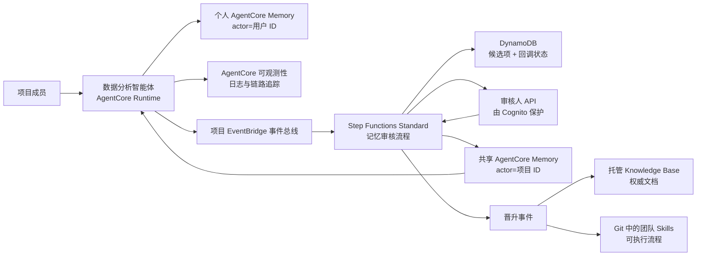

# AgentCore 记忆治理蓝图

> 本文档为主版本。English: **[README.en.md](README.en.md)**。

**想先看结论？** 直接读 **[实验报告](docs/实验报告.md)** —— 完整的实验过程、14 项检查的
真实数据与结论。桌面客户端（Claude Code / Codex）如何安全共用这套云端 Memory，见
**[桌面客户端集成设计](docs/桌面客户端集成设计.md)**。其余中文文档：
[架构设计](docs/架构设计.md) · [设计取舍依据](docs/设计取舍依据.md) ·
[下一步演进](docs/下一步演进.md) · [演示手册](docs/演示手册.md) ·
[评估记录](docs/评估记录.md) · [参考资料](docs/参考资料.md) ·
[安全说明](SECURITY.md)

一套 AWS 参考实现，面向多用户数据分析智能体（agent），具备以下能力：

- 将对话轮次写入用户个人的 AgentCore 短期记忆（short-term memory）；
- 由 AgentCore 自动从中抽取个人偏好并沉淀为长期记忆（long-term memory）；
- 通过 EventBridge 提交项目级记忆候选项（candidate）；
- 共享项目记忆在发布前必须经过人工审核；
- 将日志、记忆、Knowledge Bases 与团队 Skills 划分为彼此独立的知识层；
- 提供一条可审计的晋升（promotion）路径，把记忆固化为文档或 Skills。

## 核心特点

这里的记忆是**带权威等级的受治理资产**，而不是一个更聪明的向量库。以下四条不是常见做法，
且每条都有外部证据支撑 —— 完整论证与反向证据见
**[设计取舍依据](docs/设计取舍依据.md)**。

**一、批准原文逐字入库，不做二次 LLM 抽取。**
这既是治理正确，也恰好是性能与成本上的最优 —— 后半句反直觉。ICLR 2026 一项 3×3 因子实验
（写入策略 × 检索方法，LoCoMo 1,540 题非对抗子集）显示：**检索方法拉动 20 个点
（57.1% → 77.2%），写入策略只拉动 3–8 个点；而零 LLM 调用的原始分块存储，打平甚至优于
mem0 式抽取与 MemGPT 式摘要**（[arXiv:2603.02473](https://arxiv.org/abs/2603.02473)）。
抽取管线是整条链上最贵、最有损、收益最小的一环。旁证：mem0 在 2026 年的重写中把
`UPDATE`/`DELETE` 从写入路径彻底移除，退回单次追加、矛盾并存、排序阶段再判 —— 一个以
写入期裁决为卖点的产品主动放弃了写入期裁决。

**二、四层知识分层（日志 / 记忆 / Knowledge Base / Skills）以「权威」为划分依据。**
业内通行的 working / episodic / semantic / procedural 源自 Tulving 1972，经 CoALA 进入
agent 领域；而 2025 年 12 月那篇 47 位作者的综述已明确指出传统分类法不足以刻画当代记忆
系统，转而按 forms（token / parametric / latent）× functions × dynamics 重切
（[arXiv:2512.13564](https://arxiv.org/abs/2512.13564)）。本蓝图按**权威**分层的意义在于：
「权威」是可运营属性，能直接推导出谁能写、谁能覆盖谁；「episodic」只能用于分类。

**三、检索优先级是铁律，且随上下文一起交给模型。**
实时数据 > Skills > 权威文档 > 已审团队记忆 > 个人偏好 > 模型推断，个人偏好只能影响呈现
方式。这条对准三个已命名的失效模式：**experience following**（智能体忠实复现所检索内容的
质量，包括其中的错误）；**lost-in-the-middle**（中段证据的取用可靠性显著下降，
[Liu et al., TACL 2024](https://arxiv.org/abs/2307.03172)）；以及 **context rot** —— 它在
干扰项与答案语义相似时最严重，而这恰是记忆库的固有构成，因为记忆被召回的原因**就是**它相似。
因此"记忆永不覆盖实时数据"不是洁癖，而是阻止陈旧记忆污染当前判断的结构性约束。实现上，
`src/agent/context_builder.py` 把 `conflict_rule` 与优先级顺序连同 citation envelope
（record ID、namespace、相关度、strategy ID）一起放进 prompt —— 优先级是显式指令，
不是文档里的约定。

**四、人工审核闸门是当前稀缺的反投毒控制。**
这不是理论风险。**MINJA** 仅通过普通对话即可把恶意记录写入记忆库，无需任何数据库权限，
且护栏模型、embedding 消毒、基于提示词的检测**全部失效**
（[arXiv:2503.03704](https://arxiv.org/abs/2503.03704)，NeurIPS 2025）。已公开事故包括
SpAIware、LayerX "Tainted Memories"、Radware "ZombieAgent"。最贴题的是 **MemoryTrap** ——
针对 Claude Code，已披露并修复，单个被投毒的记忆对象跨会话、跨用户、跨子智能体扩散
（[Help Net Security](https://www.helpnetsecurity.com/2026/04/14/idan-habler-cisco-agentic-ai-memory-attacks/)）。
本蓝图做的正是桌面端 Claude Code / Codex 共用云端记忆，这就是"共享写入路径必须过人"的
直接正当性。

> **范围必须说清：审核只覆盖团队层。** 个人长期记忆由 AgentCore 抽取写入、短期事件为直接
> 写入，两者都无审核环节 —— MemoryTrap 那类传播模式在这两层依然成立。IAM 把个人记忆的
> 爆炸半径限制在单个 actor 内，但那是隔离，不是审核。

以上属性已在真实部署上端到端验证：[实验报告](docs/实验报告.md)（14 项检查）与
[桌面客户端集成设计](docs/桌面客户端集成设计.md)（8 + 17 项检查，含**镜像对照** ——
同一个 role 下 Alice 与 Bob 权限完全反转，排除"策略碰巧写死"）。已知差距与后续计划
（含仍未强制的证据不可变性、可自提自批）见**[下一步演进](docs/下一步演进.md)**。

## 架构



本蓝图刻意使用**两个 Memory 资源**：

1. `PersonalMemory` 由智能体运行时写入。它的 actor 是经过身份认证的用户 ID，其
   策略（strategy）负责抽取用户偏好和会话摘要。
2. `SharedProjectMemory` 只允许审核发布角色写入。审核通过后直接在项目命名空间
   （namespace）中创建长期记录，因此已审核的文本不会再被另一个抽取模型改写。

相比把个人记录和共享记录放进同一个资源、仅依靠命名空间约定来隔离，这种做法提供了
更强的隔离边界。

## 代码仓库结构

- `infra/`：AWS CDK 堆栈，包含 Memory、EventBridge、Step Functions、DynamoDB、
  Cognito、SNS 以及审核人 API。
- `src/agent/`：由 AgentCore 托管的智能体在完成一轮对话后调用的适配层。它同时负责
  从 Knowledge Base、共享记忆和个人偏好中构建带来源标注的上下文。
- `src/handlers/`：负责审核注册、回调、决策、发布和审计状态的 Lambda 处理函数。
- `src/blueprint/`：共享领域模型与 AgentCore Memory 客户端代码。
- `contracts/`：EventBridge 事件契约示例。
- `skills/`：一个团队 Skill 示例，展示晋升路径的最终形态。
- `tests/`：无需 AWS 账号即可运行的本地测试。

文档以中文为主版本，英文版同步维护：

| 中文（主） | English | 内容 |
|---|---|---|
| [实验报告](docs/实验报告.md) | [scenario-test-report](docs/scenario-test-report.md) | 治理属性的真实实测过程与 14 项检查结果 |
| [桌面客户端集成设计](docs/桌面客户端集成设计.md) | — | 桌面端身份方案与 8 + 17 项实测 |
| [架构设计](docs/架构设计.md) | [architecture](docs/architecture.md) | 信任边界、检索优先级与信息生命周期 |
| [设计取舍依据](docs/设计取舍依据.md) | [design-rationale](docs/design-rationale.md) | 核心特点的取舍理由与外部证据 |
| [下一步演进](docs/下一步演进.md) | [roadmap](docs/roadmap.md) | 按优先级排列的演进项，含取代语义 |
| [演示手册](docs/演示手册.md) | [demo-runbook](docs/demo-runbook.md) | 端到端演示流程 |
| [评估记录](docs/评估记录.md) | [sample-review](docs/sample-review.md) | 官方示例的吸收结论与刻意推迟项 |
| [参考资料](docs/参考资料.md) | [references](docs/references.md) | 已核验的 AWS 官方资料 |
| [安全说明](SECURITY.md) | [SECURITY.en](SECURITY.en.md) | 数据处理、依赖审计与安全边界 |

英文实验报告 `docs/scenario-test-report.md` 由 `poc/run_demo_scenario.py` 自动生成，
含每轮完整 prompt 与回答；中文版为其解读版本。

## 事件术语

这里存在两类完全不同的"事件"：

- **AgentCore Memory event（记忆事件）**：通过 `CreateEvent` 写入的不可变对话事件；
  它属于短期记忆，并可触发异步抽取。
- **AgentCore Memory record（记忆记录）**：由抽取过程生成，或通过
  `BatchCreateMemoryRecords` 直接创建的长期条目。
- **EventBridge domain event（领域事件）**：形如 `memory.candidate.proposed` 的路由
  信封，用于启动治理工作流。

三者被刻意区分，不可混用。

## 快速开始

```bash
python3 -m unittest discover -s tests -v
./poc/build_lambda_layer.sh
cd infra
nvm use
npm install
npm run build
npm test
npx cdk synth
```

`cdk synth` 不会调用 AWS 账号。实际部署需要已完成 CDK bootstrap 的环境，以及创建
AgentCore Memory 资源的权限。

共享记忆发布器和基于元数据过滤的检索依赖 `src/requirements.txt` 中指定的 SDK 版本。
请将其打包进每个 Lambda 制品或一个受控的 Lambda layer；不要假设 Python 运行时预装的
`boto3` 已包含当前的 AgentCore 服务模型。

## 部署输入参数

`projectId` 和 `environmentName` 决定了所有资源的名称。它们在 `infra/cdk.json` 中固定
（本 POC 使用 `analytics-poc` / `demo`），任一缺失都会导致 synth 失败。修改它们会让
CloudFormation 替换整个堆栈——此时被保留（retained）的 Memory 资源和 DynamoDB 表会以
`AlreadyExists` 阻塞新堆栈，因此只有在部署一个真正独立的环境时才应覆盖这两个参数。

```bash
cd infra
npx cdk deploy \
  -c projectId=analytics-poc \
  -c environmentName=demo \
  -c reviewerOrigin=http://localhost:3000
```

部署完成后：

1. 创建一个 Cognito 审核人用户，并将其加入堆栈输出的项目专属审核人组。
2. 为审核人订阅那个已加密的 SNS 主题。
3. 用堆栈输出中的事件总线名称以及个人/共享 Memory ID 配置智能体运行时。
4. 按照演示手册（runbook）提交一个候选项并完成审批。

Knowledge Base ID 是一个集成参数，而不是本堆栈创建的资源。一个真实可用的 Knowledge
Base 需要明确的数据源、分块策略、向量存储、摄取作业和检索效果验证；这些决策不应被
隐藏在一个记忆能力的演示里。

## 适用范围与限制

本项目是 POC。以下边界均为刻意为之；把它们当作生产就绪会歪曲已验证的内容。

- **审核仅覆盖共享层。** 个人长期记忆由 AgentCore 抽取写入，无审核环节。"记忆已经过
  审核"对团队知识成立，对个人偏好不成立。
- **个人隔离的强度取决于走哪条路径。** 桌面路径在 IAM 层强制；AgentCore Runtime 角色
  服务所有用户，因此依赖应用层的 actor 归属校验 —— 这是最重要的未完成项。
- **政策闸门读取的是申报标签。** 它校验自行申报的隐私分级与置信度分值，不检查内容是否
  含有凭据或个人数据。
- **已批准事实没有取代通路。** 一条后来变为假的陈述，会保持可检索直到资源过期。
- **已验证的是治理属性，未测量回答质量。** 本项目不宣称记忆提升了输出质量。

逐项严重度表见[实验报告](docs/实验报告.md)第九章与
[桌面客户端集成设计](docs/桌面客户端集成设计.md)第十一章。按优先级排列的修复计划见
[下一步演进](docs/下一步演进.md)。
