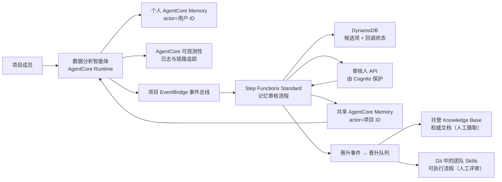

# AgentCore 记忆治理蓝图

> 本文档为主版本。English: **[README.en.md](README.en.md)**。

多用户共用一个智能体（agent）时，个人记忆严格隔离，而有价值的经验经人工审核后成为团队
共享知识。基于 Amazon Bedrock AgentCore Memory 的 AWS 参考实现。

企业里稀缺的不是记忆存储，是让经验被写下来的那一刻。Knowledge Base 与 Skills 的困难从来
不在存储或检索，而在于**没有自然的写入触发点** —— 所以本项目治理的是共享记忆的**写入
边界**：结构化提案 → 策略闸门 → 人工审核 → 逐字入库 → 可归因、可撤销。KB 与 Skills 不是
它的竞品，是它的下游。

> **承重边界：记忆治理是记忆域内的承重，不是整个智能体生态的承重。** 智能体效果由观测 →
> 评估 → 优化闭环负责，记忆治理是那个闭环的输入之一。治理的目标函数是爆炸半径、可归因性
> 与可撤销性，不是单次问答的正确性 —— 本项目不声称治理提升回答质量。

**想先看结论**：[实验报告](docs/实验报告.md)（真实运行 + 14 项检查）·
[桌面客户端集成设计](docs/桌面客户端集成设计.md)（Claude Code / Codex 如何共用云端记忆）

## 企业治理入口

本仓库同时提供一套面向企业架构评审、发布门禁和审计取证的治理层。现有 README、架构文档
和实验报告描述参考实现本身；下列文档把它提升为可分配责任、可验证控制和可复现实验：

| 中文（主） | English | 用途 |
|---|---|---|
| [企业治理蓝图](docs/ENTERPRISE_GOVERNANCE_BLUEPRINT.md) | [enterprise governance blueprint](docs/ENTERPRISE_GOVERNANCE_BLUEPRINT.en.md) | 多账户、Region、租户、身份、网络、数据、运营和跨服务契约 |
| [最低控制基线](docs/CONTROL_BASELINE.md) | [control baseline](docs/CONTROL_BASELINE.en.md) | MUST/SHOULD/MAY 控制、证据、发布门禁和例外模板 |
| [跨服务可观测性蓝图](docs/OBSERVABILITY_BLUEPRINT.md) | [observability blueprint](docs/OBSERVABILITY_BLUEPRINT.en.md) | 服务遥测、ADOT/OTEL、实验取证和长期分析归档 |
| [企业实验路线](experiments/README.md) | [enterprise experiment path](experiments/README.en.md) | E00–E07 递进实验、负向测试、成本和清理 |
| [官方样例目录](docs/AWS_SAMPLE_CATALOG.md) | [AWS sample catalog](docs/AWS_SAMPLE_CATALOG.en.md) | 固定提交、能力映射、生产差距和样例漂移 |

**事实快照（复核于 2026-08-04）**：AgentCore Memory 当前在 15 个商业 Region 可用；
当前企业相关能力包括长期记录 batch CRUD、indexed/strictly-consistent metadata、
Kinesis record streaming，以及控制面和数据面 PrivateLink；CDK L2 已进入稳定版（以
[Release Notes](https://docs.aws.amazon.com/bedrock-agentcore/latest/devguide/release-notes.html)
为准）。
短期事件保留范围为 7–365 天；每个 Region、每个账户默认最多 150 个 Memory 资源，每个资源
最多 6 个策略；`CreateEvent` 默认配额为 200 TPS，单 actor + session 的会话消息为 5 TPS，
`RetrieveMemoryRecords` 为 30 TPS。定价为每 1,000 个新事件 0.25 美元；长期记录按月每
1,000 条 0.75 美元（内置策略）或 0.25 美元（override/自管策略，模型费用另计）；
每 1,000 次检索 0.50 美元。Region、配额和价格会变化，生产决策必须重新核验官方
[Region 表](https://docs.aws.amazon.com/bedrock-agentcore/latest/devguide/agentcore-regions.html)、
[配额页](https://docs.aws.amazon.com/bedrock-agentcore/latest/devguide/bedrock-agentcore-limits.html)
与[定价页](https://aws.amazon.com/bedrock/agentcore/pricing/)。

## 核心特点

记忆是**带权威等级的受治理资产**，不是一个更聪明的向量库。三句概括，不依赖任何平台
（完整论证见[为什么按写入权威分层](docs/为什么按写入权威分层.md)）：知识分层按**「谁有权
改」**而非按 episodic/semantic 划分，冲突裁决因此从语义判断变成查表；检索优先级是**全序**
且随上下文交给模型，把"哪些记忆相关"（无解）换成"哪种权威胜出"（有解）；共享层是**知识
资产的预备区**，比向量库有治理、比写文档摩擦小，稳定后向上晋升。

下列四条设计判断给出实现层的取舍，依据与反向证据见[设计取舍依据](docs/设计取舍依据.md)：

- **批准原文逐字入库。** 审核通过后走 `BatchCreateMemoryRecords` 直接写入长期记录，
  `content.text` 就是审核员批准的那段字符串本身，不经第二次模型抽取改写 —— 因此
  「审核员看到的」与「库里存的」逐字节相同。个人偏好则相反，走 `CreateEvent` +
  AgentCore 策略抽取，措辞由模型重写。
- **知识分六层，按「谁有权改」而非按记忆类型划分**：日志（观测）、短期记忆（原始交互）、
  个人长期记忆（抽取所得）、共享长期记忆（已审核）、Knowledge Base（文档所有者）、
  Skills（Git 评审）。每层的写入者与可否被智能体直接检索都是确定的 —— 因此
  「记忆可否覆盖文档」有唯一答案，而 `episodic`/`semantic` 这类分类回答不了这个问题。
- **检索优先级是铁律，且随上下文一起交给模型。** 实时数据 > Skills > 权威文档 >
  已审团队记忆 > 个人偏好；个人偏好只能影响呈现方式。这条把「哪些记忆相关」换成
  「哪种权威胜出」—— 后者有确定答案，前者没有；也是防止陈旧记忆覆盖当前数据的唯一约束。
- **人工审核是共享写入的唯一入口。** 智能体与桌面客户端在 IAM 层就不持有共享写权限，
  团队知识只能提案。
- **提案是结构化契约，不是一段自由文本。** 每条候选项必须携带：可独立理解的陈述、五种
  `category` 之一（`fact`/`decision`/`constraint`/`incident`/`procedure_hint`）、指向
  不可变记录的 `evidence_ref`（`trace://`/`s3://`/`log://` —— 本地 transcript 可改可删，
  不算证据）、置信度与隐私分级。署名不可伪造：`proposer_actor_id` 由服务端从 token 的
  `sub` 派生，body 填什么都被忽略。这套契约把「什么算团队知识」变成了可校验的形状，而非
  惯例。

> 审核只覆盖**团队层**。个人长期记忆与短期事件无审核环节 —— IAM 限制其爆炸半径，
> 但隔离不等于审核。

## 适用范围与限制

本项目是 POC，以下边界刻意为之：

- **个人隔离的强度取决于路径。** 桌面路径由 IAM 强制；Runtime 角色服务所有用户，依赖
  应用层 actor 归属校验 —— 最重要的未完成项。
- **政策闸门读取申报标签**，不检查内容是否含凭据或个人数据。
- **提案的判断标准已给出，触发时机仍缺。** 五个 `category` 的语义与"不该提案什么"已写入
  工具描述，但没有 hook 在每轮后评估是否值得提案，因此提案仍依赖用户显式要求 —— 若无人
  提案，治理链路空转。
- **已批准事实没有取代通路，且没有过期兜底。** 共享记录由
  `BatchCreateMemoryRecords` 直接创建，没有对应的 source event，因此按 event 生效的
  `eventExpiryDuration` 碰不到它，`MemoryRecordCreateInput` 上也没有任何 expiry 字段 ——
  变为假的陈述永久可检索，且带 `review_status=approved` 预过滤标签，在检索里是一等公民。
  记录级移除只有显式 `DeleteMemoryRecord` / `BatchDeleteMemoryRecords`。
- **已验证的是治理属性，未测量回答质量。** 治理的目标函数是爆炸半径、可归因性与可撤销性，
  不是单次问答的正确性。共享层是否回本由两个聚合数决定 —— 共享命中率与重复提问率 ——
  `src/agent/context_builder.py` 现在为每次检索记录一条指标，
  `poc/analyze_retrieval_metrics.py` 将其汇总；查询以逐 token 哈希留存，不落原文。
  尚未积累足够运行来给出这两个数。
- **闸门管不了去重。** 实验中共享层 4 条记录里有 2 条是同一句话，相关度分数同为 0.6626
  （[实验报告](docs/实验报告.md)检查 13）。闸门判断"够不够格"，天然不判断"是不是已经有了"，
  而共享层的全部价值来自信噪比。
- **够格的团队知识可能极其稀少。** 一项针对记忆晋升闸门的研究报告称，闸门把内部 false
  promotion 从 0.371 降到 0.032，但在 133 条外部高影响力候选上，人工裁决认为**没有一条**
  适合自动晋升（[arXiv:2607.02579](https://arxiv.org/abs/2607.02579)）。若如此，审核队列
  长期为空可能不是链路故障，而是真实产出率。
- **审核者会疲劳，且疲劳是有方向的。** 一项覆盖 400 名重复审核者、11,429 次 AI 智能体 PR
  审核的研究报告称，批准率从 30.1% 升至 36.8%，同一审核者跨经验分位上升 14.5 个百分点，
  同时行内评论减少 22%（[arXiv:2606.22721](https://arxiv.org/abs/2606.22721)）。人工闸门
  的有效性随使用而衰减，本项目未测量这一衰减。

逐项严重度见[实验报告](docs/实验报告.md)第九章与
[桌面客户端集成设计](docs/桌面客户端集成设计.md)第十一章；修复计划见
[下一步演进](docs/下一步演进.md)。

## 与业内产品的关系

完整横评（含一手来源与未核实项）见**[记忆产品横评](docs/记忆产品横评.md)**。

**本蓝图依赖的平台能力**：隔离由 `bedrock-agentcore:actorId`/`namespace` 等 IAM 条件键在
平台侧强制，而不是由应用层参数或数据库列表达 —— 这是治理边界能落到 IAM 上的前提。元数据
过滤是**预过滤**（在向量检索前缩小候选集）、10 个操作符、`STRICTLY_CONSISTENT` 元数据可由
应用直接设定不经 LLM 推断，以及 count-based 计费。

**当前需要自建的部分**：检索为语义检索，不提供 BM25、hybrid 或重排，embedding 模型也不暴露。
记忆记录没有生命周期状态字段，因此失效与取代语义必须自建 —— 这正是[下一步演进](docs/下一步演进.md)
第 4 项的内容。这里有一处必须写明的官方来源分歧：AWS 博客称 consolidation 会把过时记忆标为
`INVALID`，但 API 参考里的记忆记录没有任何状态字段，流式事件只有增/改/删 —— **官方来源之间
不一致时，本蓝图按 API 文档行事，不依赖该行为**。

**放大效应在于三处相互增强**：治理条件因预过滤而进入检索路径本身 —— 未批准与被取代的
记录不参与相似度竞争，而非事后筛除；逐字入库使 AgentCore 的抽取质量在共享层完全不构成
风险；取代机制用离散状态标志实现，绕开平台空白，且不引入业内公认最不可靠的 LLM 矛盾裁决。

**适用判断**：本蓝图解决的是多用户隔离与团队知识问责。若首要目标是检索质量或关键词精确
匹配，那是另一个问题，本蓝图不声称在那条轴上更优。分层本身允许两者并存 —— 个人层的后端是
可替换的，共享层保留 IAM 加人工审核即可。

## AWS 官方依据

逐条原文、实现位置（精确到行）与实测证据见**[AWS 官方背书](docs/AWS官方背书.md)**。

Well-Architected Lens 是**现场实践的后验编纂，不是实践的前置许可** —— 它的形成路径是
解决方案架构师反复遇到同类问题、沉淀出模式、验证后才成文。所以下面不是「AWS 定规范、
本项目照做」，而是三种不同的关系：

**一、AWS 已编纂，本项目是可运行的参考实现**

[AGENTSEC04-BP02 Human-in-the-loop for critical decisions](https://docs.aws.amazon.com/wellarchitected/latest/agentic-ai-lens/agentsec04-bp02.html)
（未建立此实践的风险等级：**High**）几乎是本审批链路的规格说明书：

| 本实现 | AWS 官方原文 |
|---|---|
| `memory-governance-stack.ts:470` 用 `WAIT_FOR_TASK_TOKEN` | "AWS Step Functions **.waitForTaskToken callback pattern introduces an approval step**" |
| `reviewer_api.py:66,87` 返回前 `pop` 掉 token | "**Reviewers don't typically call Step Functions APIs directly. The approval app holds the credentials**" |
| `domain.py:101-105` 纯布尔闸门，无模型参与 | "**Risk classification itself can't rely on an LLM** exposed to the same untrusted content... Use **deterministic logic**" |
| `evidence_ref` 指向不可变 S3 对象版本 | "**Store the full decision context in durable storage such as Amazon S3**" |
| 记录 `reviewer_id` 与决策时间 | "**log human approval decisions with timestamps and reviewer identities**" |

隔离机制同样有官方出处：[Service Authorization Reference](https://docs.aws.amazon.com/service-authorization/latest/reference/list_bedrock-agentcore.html)
确认 `bedrock-agentcore:actorId`、`namespace`、`sessionId` 为 IAM 条件键；
[GenAI 安全参考架构](https://docs.aws.amazon.com/prescriptive-guidance/latest/security-reference-architecture-generative-ai/gen-auto-agents.html)
要求 "**Prevent memory poisoning by ensuring that users can't modify their session ID or
actor ID**" —— 这正是 bridge 不暴露任何 `actor_id` 参数的原因。

**二、AWS 指出方向，但平台不提供原语**

[AGENTSEC01 Secure agent memory and state](https://docs.aws.amazon.com/wellarchitected/latest/agentic-ai-lens/agentsec01.html)
的五级成熟度模型把 "**Memory governance is codified and auditable**" 列为 Level 5 目标，
并要求 "Every write path into memory... passes through a layered validation pipeline
before data reaches the store"。但 AgentCore Memory **没有记忆写入的审核闸门**，
Step Functions 集成表里 AgentCore 的 `.waitForTaskToken` 也是 Not supported —— 这一层
必须自建。本项目就是这段空白的实现。

按该模型自评的结果暴露一个**错位**：已达 Level 5 的治理可审计，却缺 Level 3 的
Guardrails 与 PII 过滤、Level 4 的 HMAC 逐读校验。即**治理维度很深，内容安全与运行时
完整性维度仍浅**（详见[下一步演进](docs/下一步演进.md)第 9 项）。

**三、AWS 尚未覆盖，属本项目的工程判断**

共享记忆的准入治理（AWS 讲共享命名空间，不讲"什么有资格进入"）、六级检索优先级全序、
`evidence_ref` 固定 `versionId` 作为记忆溯源、Identity Pool session tag 与单一共享角色
的组合 —— 这四项无官方来源，不应声称有背书。

> 引用纪律上的两点：`INVALID` 状态只见于 AWS 博客，**开发者指南与 API 文档中查不到**
> （详见上文"与业内产品的关系"及[记忆产品横评](docs/记忆产品横评.md)）—— 官方来源之间
> 存在不一致时，本蓝图按 API 文档行事。另有二手来源提到 `strategyId` 条件键，在官方
> Service Authorization Reference 页面未能确认，故不引用。

## 架构



刻意使用**两个 Memory 资源**：`PersonalMemory` 由运行时写入，actor 为已认证用户 ID；
`SharedProjectMemory` 只允许审核发布角色写入。相比单资源 + 命名空间（namespace）约定，
边界可表达为 IAM 里的资源 ARN，而非处处正确的字符串比较。

术语上区分三类「事件」，不可混用：**Memory event**（`CreateEvent` 写入的不可变对话事件，
属短期记忆，可触发异步抽取）、**Memory record**（长期条目，由抽取生成或
`BatchCreateMemoryRecords` 直接创建）、**EventBridge 领域事件**（如
`memory.candidate.proposed`，用于启动治理工作流）。

## 代码仓库结构

- `infra/`：CDK 堆栈 —— Memory、EventBridge、Step Functions、DynamoDB、Cognito、SNS、审核人 API
- `src/agent/`：运行时适配层，构建带来源标注的上下文
- `src/handlers/`：审核注册、回调、决策、发布、审计状态的 Lambda
- `src/blueprint/`：领域模型与 AgentCore Memory 客户端
- `contracts/`、`skills/`、`tests/`：事件契约示例、团队 Skill 示例、本地测试

文档以中文为主版本，英文版同步维护：

| 中文（主） | English | 内容 |
|---|---|---|
| [实验报告](docs/实验报告.md) | [scenario-test-report](docs/scenario-test-report.md) | 真实实测过程与 14 项检查结果 |
| [桌面客户端集成设计](docs/桌面客户端集成设计.md) | [desktop-client-integration](docs/desktop-client-integration.md) | 桌面端身份方案与 8 + 17 项实测 |
| [架构设计](docs/架构设计.md) | [architecture](docs/architecture.md) | 信任边界、检索优先级、信息生命周期 |
| [设计取舍依据](docs/设计取舍依据.md) | [design-rationale](docs/design-rationale.md) | 核心特点的取舍理由与外部证据 |
| [为什么按写入权威分层](docs/为什么按写入权威分层.md) | [why-layer-by-write-authority](docs/why-layer-by-write-authority.md) | 不依赖任何平台的分层论证与承重边界 |
| [定位分析](docs/定位分析.md) | [positioning-analysis](docs/positioning-analysis.md) | 外部调研笔记：差异化在哪、四个必答反驳、不可引用清单 |
| [AWS 官方背书](docs/AWS官方背书.md) | [aws-alignment](docs/aws-alignment.md) | 每条主张对齐到 AWS 官方文档，含实现位置与实测证据 |
| [记忆产品横评](docs/记忆产品横评.md) | [memory-landscape](docs/memory-landscape.md) | AgentCore 与 mem0/Zep/Letta 等的能力对照与放大效应 |
| [下一步演进](docs/下一步演进.md) | [roadmap](docs/roadmap.md) | 按优先级排列的演进项，含取代语义 |
| [演示手册](docs/演示手册.md) | [demo-runbook](docs/demo-runbook.md) | 端到端演示流程 |
| [评估记录](docs/评估记录.md) | [sample-review](docs/sample-review.md) | 官方示例的吸收结论与推迟项 |
| [参考资料](docs/参考资料.md) | [references](docs/references.md) | 已核验的 AWS 官方资料 |
| [安全说明](SECURITY.md) | [SECURITY.en](SECURITY.en.md) | 数据处理、依赖审计、安全边界 |

`docs/scenario-test-report.md` 由 `poc/run_demo_scenario.py` 自动生成，含每轮完整 prompt
与回答；中文版为其解读版本。

## 快速开始

```bash
./scripts/install_hooks.sh
python3 -m unittest discover -s tests -v
./poc/build_lambda_layer.sh
cd infra && nvm use && npm install && npm run build && npm test && npx cdk synth
```

`install_hooks.sh` 装一个 pre-commit 钩子：提交涉及文档时校验中英配对是否同步，不同步即
拦下（见 [CLAUDE.md](CLAUDE.md)）。钩子不随仓库克隆，每个 checkout 需装一次。

`cdk synth` 不调用 AWS 账号。部署需已 bootstrap 的 CDK 环境与创建 AgentCore Memory 的权限。

共享记忆发布器和元数据过滤检索依赖 `src/requirements.txt` 指定的 SDK 版本 —— 请打包进
Lambda 制品或受控 layer，不要假设运行时预装的 `boto3` 含当前 AgentCore 服务模型。

## 部署

`projectId` 与 `environmentName` 决定所有资源名称，在 `infra/cdk.json` 中固定
（本 POC 为 `analytics-poc` / `demo`）。修改会导致 CloudFormation 替换整个堆栈，而被保留
（retained）的 Memory 资源与 DynamoDB 表会以 `AlreadyExists` 阻塞新堆栈 —— 只在部署真正
独立的环境时才覆盖。

```bash
cd infra
npx cdk deploy \
  -c projectId=analytics-poc \
  -c environmentName=demo \
  -c reviewerOrigin=http://localhost:3000
```

部署后：创建 Cognito 审核人并加入堆栈输出的审核人组 → 订阅已加密的 SNS 主题 → 用堆栈
输出配置运行时（事件总线名、个人/共享 Memory ID）→ 按[演示手册](docs/演示手册.md)提交并
审批一个候选项。

共享 Memory 的 `indexedKeys` 在 `CreateMemory` 时固定，不可增删、不回填，而该资源是
`RETAIN` 的。取代机制所需的 `superseded_by` 已提前声明，但已部署的资源不会因此获得该键 ——
只有新建的 Memory 资源才带上它。

Knowledge Base ID 是集成参数，非本堆栈创建的资源：真实可用的 Knowledge Base 需要明确的
数据源、分块策略、向量存储、摄取作业与检索验证，这些决策不应隐藏在记忆演示里。

