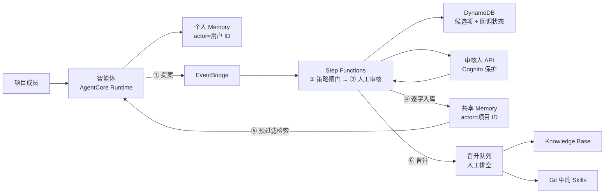

# AgentCore 共享记忆治理蓝图

> 本文档为主版本。English: **[README.en.md](README.en.md)**。

多用户共用一个智能体（agent）时，个人记忆严格隔离，而有价值的经验经人工审核后成为团队
共享知识。基于 Amazon Bedrock AgentCore Memory 的 AWS 参考实现。

共享记忆的主要工程难点在于何时、由谁将经验写入共享层。Knowledge Base 与 Skills 承载
稳定知识；本项目治理它们上游的共享记忆**写入边界**，为知识沉淀提供明确的触发与审核路径。

**实测结果**：[实验报告](docs/实验报告.md)（真实运行 + 14 项检查）·
[演示手册](docs/演示手册.md)（端到端跑一遍）

## 共享记忆链路

一条经验从被说出到成为团队知识，要走完六步。每一步都有确定的写入者、确定的代码位置，以及
一条可核对的官方依据。



| 步骤 | 做什么 | 代码位置 | 官方依据 |
|---|---|---|---|
| ① **提案** | 智能体只能提案，不能写共享层。候选项是结构化契约：陈述、五种 `category`、指向不可变记录的 `evidence_ref`、置信度、隐私分级 | `bridge/server.py:322`（`memory_propose_shared`）、`src/blueprint/domain.py:27` | [一、人工审核是共享写入的唯一入口](docs/AWS官方背书.md#一人工审核是共享写入的唯一入口)、[三、按 actorId 与 namespace 做隔离](docs/AWS官方背书.md#三按-actorid-与-namespace-做隔离由-iam-强制) |
| ② **策略闸门** | 纯布尔判断，无模型参与：`privacy_classification != "restricted" and confidence >= 0.70` | `src/blueprint/domain.py:103` | [二、政策闸门用确定性规则，不用 LLM](docs/AWS官方背书.md#二政策闸门用确定性规则不用-llm) |
| ③ **人工审核** | Step Functions `WAIT_FOR_TASK_TOKEN` 挂起等待；审核人 API 返回前 `pop` 掉 token，一次性生效 | `infra/lib/memory-governance-stack.ts:503`、`src/handlers/reviewer_api.py:68` | [一、人工审核是共享写入的唯一入口](docs/AWS官方背书.md#一人工审核是共享写入的唯一入口) |
| ④ **逐字入库** | 走 `BatchCreateMemoryRecords` 直接写长期记录，`content.text` 就是审核员批准的那段字符串，不经二次模型改写 | `src/blueprint/memory.py:56` | [五、逐字发布：批准的文本原样入库](docs/AWS官方背书.md#五逐字发布批准的文本原样入库) |
| ⑤ **预过滤检索** | 按 `review_status = approved` 过滤，**在向量检索之前**缩小候选集 —— 未批准记录不参与相似度竞争 | `src/agent/context_builder.py:135` | [四、记忆不是权威事实，不得覆盖当前数据](docs/AWS官方背书.md#四记忆不是权威事实不得覆盖当前数据) |
| ⑥ **晋升** | 批准且带 `promotion_hint` 时发出领域事件，路由到 KMS 加密队列由人排空 | `src/handlers/mark_status.py:52`、`infra/lib/memory-governance-stack.ts:389` | [AWS 未覆盖的部分](docs/AWS官方背书.md#aws-未覆盖的部分) —— 属工程判断 |

每条依据的官方原文、实现位置与实测证据都在 **[AWS 官方背书](docs/AWS官方背书.md)**；该文档同时
列出[不可作为 AWS 官方来源引用](docs/AWS官方背书.md#不可作为-aws-官方来源引用)的部分。

**本设计使用两个 Memory 资源**：`PersonalMemory` 由运行时写入，actor 为已认证用户 ID；
`SharedProjectMemory` 只允许审核发布角色写入。相比单资源加命名空间约定，边界可表达为 IAM
里的资源 ARN，而非处处都要写对的字符串比较。

> 术语上区分三类「事件」，不可混用：**Memory event**（`CreateEvent` 写入的不可变对话事件，
> 属短期记忆）、**Memory record**（长期条目，由抽取生成或 `BatchCreateMemoryRecords` 直接
> 创建）、**EventBridge 领域事件**（如 `memory.candidate.proposed`，用于启动治理工作流）。

## 为什么这样分层

本项目将记忆视为**带权威等级的受治理资产**，向量检索只是其中一个实现组件。以下三点
不依赖任何平台
（完整论证见 **[为什么按写入权威分层](docs/为什么按写入权威分层.md)**）：

- 知识分层按**「谁有权改」**而非按 episodic/semantic 划分 —— 冲突裁决因此从语义判断变成
  查表，而查表可以在检索之前完成，不需要模型参与。
- 检索优先级是**全序**，且随上下文一起交给模型：实时数据 > Skills > 权威文档 > 已审团队
  记忆 > 个人偏好。系统据此先确定冲突信息的权威顺序，再执行相关性判断。
- 共享层是**知识资产的预备区**：比向量库有治理，比写文档摩擦小，稳定后向上晋升。

各项取舍的依据与反向证据见 **[设计取舍依据](docs/设计取舍依据.md)**；信任边界与信息生命
周期见 **[架构设计](docs/架构设计.md)**。

> 审核只覆盖**团队层**。个人长期记忆与短期事件无审核环节 —— IAM 限制其爆炸半径，
> 但隔离不等于审核。

## 适用范围与限制

本项目是 POC，以下边界刻意为之：

- **个人隔离的强度取决于路径。** 桌面路径由 IAM 强制；Runtime 角色服务所有用户，依赖
  应用层 actor 归属校验 —— 最重要的未完成项。
- **政策闸门读取申报标签**，不检查内容是否含凭据或个人数据。
- **提案的判断标准已给出，触发时机仍缺。** 没有 hook 在每轮后评估是否值得提案，因此提案
  仍依赖用户显式要求 —— 若无人提案，治理链路空转。
- **已批准事实没有取代通路，且没有过期兜底。** 共享记录由 `BatchCreateMemoryRecords` 直接
  创建，没有 source event，因此按 event 生效的 `eventExpiryDuration` 碰不到它，
  `MemoryRecordCreateInput` 上也没有任何 expiry 字段 —— 变为假的陈述永久可检索，且带
  `review_status=approved` 标签，在检索里是一等公民。
- **闸门管不了去重。** 实测 4 条共享记录里有 2 条是同一句话，相关度分数同为 0.6626
  （[实验报告](docs/实验报告.md)检查 13）。闸门管「够不够格」，不管「是不是已经有了」。
- **已验证的是治理属性，未测量回答质量。** 治理的目标函数是爆炸半径、可归因性与可撤销性，
  不是单次问答的正确性。共享层是否回本由共享命中率与重复提问率决定，
  `src/agent/context_builder.py` 已埋点、`poc/analyze_retrieval_metrics.py` 汇总，但尚未
  积累足够运行来给出这两个数。

修复计划与优先级见 **[下一步演进](docs/下一步演进.md)**；外部调研与四个必答反驳见
**[定位分析](docs/定位分析.md)**。

## 快速开始

```bash
./scripts/install_hooks.sh
python3 -m unittest discover -s tests -v
./poc/build_lambda_layer.sh
cd infra && nvm use && npm install && npm run build && npm test && npx cdk synth
```

`cdk synth` 不调用 AWS 账号。`install_hooks.sh` 装一个 pre-commit 钩子校验中英配对是否同步
（见 [CLAUDE.md](CLAUDE.md)），钩子不随仓库克隆，每个 checkout 需装一次。

共享记忆发布器和元数据过滤检索依赖 `src/requirements.txt` 指定的 SDK 版本 —— 请打包进
Lambda 制品或受控 layer，不要假设运行时预装的 `boto3` 含当前 AgentCore 服务模型。

## 部署

```bash
cd infra
npx cdk deploy \
  -c projectId=analytics-poc \
  -c environmentName=demo \
  -c reviewerOrigin=http://localhost:3000
```

`projectId` 与 `environmentName` 决定所有资源名称，在 `infra/cdk.json` 中固定。修改会导致
CloudFormation 替换整个堆栈，而被保留（retained）的 Memory 资源与 DynamoDB 表会以
`AlreadyExists` 阻塞新堆栈 —— 只在部署真正独立的环境时才覆盖。

部署后：创建 Cognito 审核人并加入堆栈输出的审核人组 → 订阅已加密的 SNS 主题 → 用堆栈输出
配置运行时（事件总线名、个人/共享 Memory ID）→ 按[演示手册](docs/演示手册.md)提交并审批一个
候选项。

Knowledge Base ID 是集成参数，非本堆栈创建的资源：真实可用的 Knowledge Base 需要明确的
数据源、分块策略、向量存储、摄取作业与检索验证，这些决策不应隐藏在记忆演示里。

## 代码仓库结构

- `infra/`：CDK 堆栈 —— Memory、EventBridge、Step Functions、DynamoDB、Cognito、SNS、审核人 API
- `src/agent/`：运行时适配层，构建带来源标注的上下文
- `src/handlers/`：审核注册、回调、决策、发布、审计状态的 Lambda
- `src/blueprint/`：领域模型与 AgentCore Memory 客户端
- `bridge/`：桌面客户端 MCP 服务（Claude Code / Codex 的提案入口）
- `contracts/`、`skills/`、`tests/`：事件契约示例、团队 Skill 示例、本地测试

## 附录

### 全部文档

| 中文（主） | English | 内容 |
|---|---|---|
| [实验报告](docs/实验报告.md) | [scenario-test-report](docs/scenario-test-report.md) | 真实实测过程与 14 项检查结果 |
| [架构设计](docs/架构设计.md) | [architecture](docs/architecture.md) | 信任边界、检索优先级、信息生命周期 |
| [设计取舍依据](docs/设计取舍依据.md) | [design-rationale](docs/design-rationale.md) | 核心判断的取舍理由与外部证据 |
| [为什么按写入权威分层](docs/为什么按写入权威分层.md) | [why-layer-by-write-authority](docs/why-layer-by-write-authority.md) | 不依赖任何平台的分层论证及其适用边界 |
| [AWS 官方背书](docs/AWS官方背书.md) | [aws-alignment](docs/aws-alignment.md) | 每条主张对齐到 AWS 官方文档，含实现位置与实测证据 |
| [下一步演进](docs/下一步演进.md) | [roadmap](docs/roadmap.md) | 按优先级排列的演进项，含取代语义与捕获入口设计 |
| [定位分析](docs/定位分析.md) | [positioning-analysis](docs/positioning-analysis.md) | 外部调研笔记：差异化在哪、四个必答反驳、不可引用清单 |
| [桌面客户端集成设计](docs/桌面客户端集成设计.md) | [desktop-client-integration](docs/desktop-client-integration.md) | 桌面端身份方案与 8 + 17 项实测 |
| [演示手册](docs/演示手册.md) | [demo-runbook](docs/demo-runbook.md) | 端到端演示流程 |
| [评估记录](docs/评估记录.md) | [sample-review](docs/sample-review.md) | 官方示例的吸收结论与推迟项 |
| [参考资料](docs/参考资料.md) | [references](docs/references.md) | 已核验的 AWS 官方资料 |
| [安全说明](SECURITY.md) | [SECURITY.en](SECURITY.en.md) | 数据处理、依赖审计、安全边界 |

`docs/scenario-test-report.md` 由 `poc/run_demo_scenario.py` 自动生成，含每轮完整 prompt
与回答；中文版为其解读版本。

### 企业落地扩展

面向企业架构评审、发布门禁与审计取证的一套通用方法论。它与共享记忆链路不同轴 —— 讲的是
多账户、责任边界、控制基线与递进实验，因此单独成组：

| 中文（主） | English | 用途 |
|---|---|---|
| [企业治理蓝图](docs/ENTERPRISE_GOVERNANCE_BLUEPRINT.md) | [enterprise governance blueprint](docs/ENTERPRISE_GOVERNANCE_BLUEPRINT.en.md) | 多账户、Region、租户、身份、网络、数据、运营和跨服务契约 |
| [最低控制基线](docs/CONTROL_BASELINE.md) | [control baseline](docs/CONTROL_BASELINE.en.md) | MUST/SHOULD/MAY 控制、证据、发布门禁和例外模板 |
| [跨服务可观测性蓝图](docs/OBSERVABILITY_BLUEPRINT.md) | [observability blueprint](docs/OBSERVABILITY_BLUEPRINT.en.md) | 服务遥测、ADOT/OTEL、实验取证和长期分析归档 |
| [企业实验路线](experiments/README.md) | [enterprise experiment path](experiments/README.en.md) | E00–E07 递进实验、负向测试、成本和清理 |
| [官方样例目录](docs/AWS_SAMPLE_CATALOG.md) | [AWS sample catalog](docs/AWS_SAMPLE_CATALOG.en.md) | 固定提交、能力映射、生产差距和样例漂移 |

### 平台事实快照（复核于 2026-08-18）

以下数字会变，生产决策必须重新核验官方
[Region 表](https://docs.aws.amazon.com/bedrock-agentcore/latest/devguide/agentcore-regions.html)、
[配额页](https://docs.aws.amazon.com/bedrock-agentcore/latest/devguide/bedrock-agentcore-limits.html)
与[定价页](https://aws.amazon.com/bedrock/agentcore/pricing/)。

- **可用性**：AgentCore Memory 在 15 个商业 Region 加 GovCloud (US-West) 可用。
- **配额**：每 Region 每账户 150 个 Memory 资源，每资源 6 个策略；每 Memory 最多 10 个
  索引键；`CreateEvent` 200 TPS，单 actor + session 5 TPS；短期事件保留 7–365 天。
- **定价**：每 1,000 个新事件 0.25 美元；长期记录按月每 1,000 条 0.75 美元（内置策略）或
  0.25 美元（override/自管策略，模型费用另计）；每 1,000 次检索 0.50 美元。
- **索引键**：可后加（`UpdateMemory` 的 `--add-indexed-keys`），但**不可删除、不回填** ——
  只有键存在之后写入或更新的记录才被索引。因此取代机制所需的 `superseded_by` 已提前声明；
  已部署的资源需执行一次 `UpdateMemory` 才会获得该键，`cdk deploy` 不会替换被 `RETAIN`
  保留的 Memory。
- **官方来源分歧**：`INVALID` 记忆状态只见于 AWS 博客，**API 参考中查不到** ——
  `MemoryRecord` 只有 `content`/`createdAt`/`memoryRecordId`/`memoryStrategyId`/
  `namespaces`/`metadata` 六个字段，无任何状态字段。官方来源不一致时，本蓝图按 API 文档
  行事，不依赖该行为。
