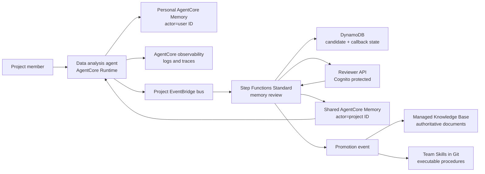

# AgentCore Memory Governance Blueprint

> 中文文档：[README.zh-CN.md](README.zh-CN.md) · **[实验报告](docs/实验报告.md)** · [桌面客户端集成设计](docs/桌面客户端集成设计.md) · [架构设计](docs/架构设计.md) · [演示手册](docs/演示手册.md)

An AWS reference implementation for a multi-user data analysis agent that:

- writes conversation turns to personal AgentCore short-term memory;
- lets AgentCore extract personal preferences into long-term memory;
- proposes project-level memory candidates through EventBridge;
- requires human review before publishing shared project memory;
- keeps logs, memory, Knowledge Bases, and team Skills as separate knowledge layers;
- exposes an auditable promotion path from memory to documents or Skills.

## Architecture



The blueprint deliberately uses **two Memory resources**:

1. `PersonalMemory` is written by the agent runtime. Its actor is the authenticated
   user ID and its strategies extract user preferences and session summaries.
2. `SharedProjectMemory` is written only by the review publisher role. Approval
   directly creates a long-term record in a project namespace, so reviewed text is
   not changed by another extraction model.

This is a stronger isolation boundary than putting personal and shared records into
one resource and relying only on namespace conventions.

## Repository

- `infra/`: AWS CDK stack for Memory, EventBridge, Step Functions, DynamoDB,
  Cognito, SNS, and the reviewer API.
- `src/agent/`: adapter called by an AgentCore-hosted agent after a completed turn.
  It also builds source-labelled context from Knowledge Base, shared memory, and
  personal preferences.
- `src/handlers/`: Lambda handlers for review registration, callback, decision,
  publishing, and audit state.
- `src/blueprint/`: shared domain and AgentCore Memory client code.
- `contracts/`: example EventBridge event contracts.
- `skills/`: an example team Skill showing the final promotion target.
- `docs/architecture.md`: trust boundaries, retrieval precedence, and information
  lifecycle.
- `docs/demo-runbook.md`: end-to-end SA demonstration.
- `docs/sample-review.md`: findings adopted from the official AgentCore samples and
  production patterns deliberately deferred.
- `docs/references.md`: official AWS sources verified for this implementation.
- `tests/`: local tests that do not require an AWS account.

## Event Terminology

There are two different event types:

- **AgentCore Memory event**: an immutable conversational event written with
  `CreateEvent`; it is short-term memory and can trigger asynchronous extraction.
- **AgentCore Memory record**: a long-term item created by extraction or directly
  with `BatchCreateMemoryRecords`.
- **EventBridge domain event**: a routing envelope such as
  `memory.candidate.proposed`; it starts governance workflows.

They are intentionally not interchangeable.

## Quick Start

```bash
python3 -m unittest discover -s tests -v
./poc/build_lambda_layer.sh
cd infra
nvm use
npm install
npm run build
npm test
npx cdk synth
```

`cdk synth` does not call the AWS account. Deployment requires a bootstrapped CDK
environment and permissions to create AgentCore Memory resources.

The shared publisher and metadata-filtered retrieval require the SDK version in
`src/requirements.txt`. Bundle it into each Lambda artifact or a controlled Lambda
layer; do not assume the Python runtime's preinstalled `boto3` has the current
AgentCore service model.

## Deployment Inputs

`projectId` and `environmentName` determine every resource name. They are pinned in
`infra/cdk.json` (`analytics-poc` / `demo` for this POC) and the synth fails if either
is missing. Changing them makes CloudFormation replace the whole stack — retained
Memory resources and DynamoDB tables then block the new stack with `AlreadyExists`, so
override them only when deploying a genuinely separate environment.

```bash
cd infra
npx cdk deploy \
  -c projectId=analytics-poc \
  -c environmentName=demo \
  -c reviewerOrigin=http://localhost:3000
```

After deployment:

1. Create a Cognito reviewer user and add it to the project-specific reviewer group
   emitted by the stack.
2. Subscribe a reviewer to the encrypted SNS topic.
3. Configure the agent runtime with the stack outputs for event bus name and
   personal/shared Memory IDs.
4. Use the runbook to publish a candidate and approve it.

The Knowledge Base ID is an integration parameter rather than a resource created by
this stack. A real Knowledge Base needs an explicit source, chunking strategy, vector
store, ingestion job, and retrieval validation; those decisions should not be hidden
inside a memory demo.
