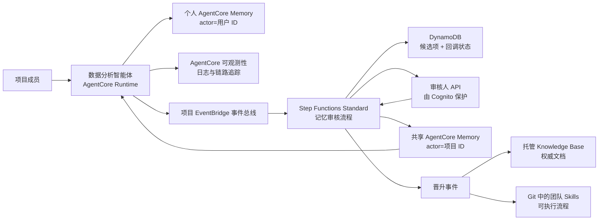

# AgentCore 记忆治理蓝图

> 本文档为 [英文原版](README.md) 的中文翻译。如有出入，以英文版为准。

**想先看结论？** 直接读 **[实验报告](docs/实验报告.md)** —— 完整的实验过程、14 项检查的
真实数据与结论。桌面客户端（Claude Code / Codex）如何安全共用这套云端 Memory，见
**[桌面客户端集成设计](docs/桌面客户端集成设计.md)**。其余中文文档：
[架构设计](docs/架构设计.md) · [演示手册](docs/演示手册.md) ·
[评估记录](docs/评估记录.md) · [参考资料](docs/参考资料.md) ·
[安全说明](SECURITY.zh-CN.md)

一套 AWS 参考实现，面向多用户数据分析智能体（agent），具备以下能力：

- 将对话轮次写入用户个人的 AgentCore 短期记忆（short-term memory）；
- 由 AgentCore 自动从中抽取个人偏好并沉淀为长期记忆（long-term memory）；
- 通过 EventBridge 提交项目级记忆候选项（candidate）；
- 共享项目记忆在发布前必须经过人工审核；
- 将日志、记忆、Knowledge Bases 与团队 Skills 划分为彼此独立的知识层；
- 提供一条可审计的晋升（promotion）路径，把记忆固化为文档或 Skills。

## 架构



本蓝图刻意使用**两个 Memory 资源**：

1. `PersonalMemory` 由智能体运行时写入。它的 actor 是经过身份认证的用户 ID，其
   策略（strategy）负责抽取用户偏好和会话摘要。
2. `SharedProjectMemory` 只允许审核发布角色写入。审核通过后直接在项目命名空间
   （namespace）中创建长期记录，因此已审核的文本不会再被另一个抽取模型改写。

相比把个人记录和共享记录放进同一个资源、仅依靠命名空间约定来隔离，这种做法提供了
更强的隔离边界。

## 代码仓库结构

- `infra/`：AWS CDK 堆栈，包含 Memory、EventBridge、Step Functions、DynamoDB、
  Cognito、SNS 以及审核人 API。
- `src/agent/`：由 AgentCore 托管的智能体在完成一轮对话后调用的适配层。它同时负责
  从 Knowledge Base、共享记忆和个人偏好中构建带来源标注的上下文。
- `src/handlers/`：负责审核注册、回调、决策、发布和审计状态的 Lambda 处理函数。
- `src/blueprint/`：共享领域模型与 AgentCore Memory 客户端代码。
- `contracts/`：EventBridge 事件契约示例。
- `skills/`：一个团队 Skill 示例，展示晋升路径的最终形态。
- `docs/architecture.md`：信任边界、检索优先级与信息生命周期。
- `docs/demo-runbook.md`：端到端的 SA 演示流程。
- `docs/sample-review.md`：从官方 AgentCore 示例中吸收的经验，以及刻意推迟实现的
  生产级模式。
- `docs/references.md`：本实现所核验过的 AWS 官方资料。
- `docs/实验报告.md`：中文实验报告，含完整过程与结果。
- `docs/架构设计.md`：`docs/architecture.md` 的中文版。
- `docs/演示手册.md`：`docs/demo-runbook.md` 的中文版。
- `docs/评估记录.md`：`docs/sample-review.md` 的中文版。
- `docs/参考资料.md`：`docs/references.md` 的中文版。
- `tests/`：无需 AWS 账号即可运行的本地测试。

## 事件术语

这里存在两类完全不同的"事件"：

- **AgentCore Memory event（记忆事件）**：通过 `CreateEvent` 写入的不可变对话事件；
  它属于短期记忆，并可触发异步抽取。
- **AgentCore Memory record（记忆记录）**：由抽取过程生成，或通过
  `BatchCreateMemoryRecords` 直接创建的长期条目。
- **EventBridge domain event（领域事件）**：形如 `memory.candidate.proposed` 的路由
  信封，用于启动治理工作流。

三者被刻意区分，不可混用。

## 快速开始

```bash
python3 -m unittest discover -s tests -v
./poc/build_lambda_layer.sh
cd infra
nvm use
npm install
npm run build
npm test
npx cdk synth
```

`cdk synth` 不会调用 AWS 账号。实际部署需要已完成 CDK bootstrap 的环境，以及创建
AgentCore Memory 资源的权限。

共享记忆发布器和基于元数据过滤的检索依赖 `src/requirements.txt` 中指定的 SDK 版本。
请将其打包进每个 Lambda 制品或一个受控的 Lambda layer；不要假设 Python 运行时预装的
`boto3` 已包含当前的 AgentCore 服务模型。

## 部署输入参数

`projectId` 和 `environmentName` 决定了所有资源的名称。它们在 `infra/cdk.json` 中固定
（本 POC 使用 `analytics-poc` / `demo`），任一缺失都会导致 synth 失败。修改它们会让
CloudFormation 替换整个堆栈——此时被保留（retained）的 Memory 资源和 DynamoDB 表会以
`AlreadyExists` 阻塞新堆栈，因此只有在部署一个真正独立的环境时才应覆盖这两个参数。

```bash
cd infra
npx cdk deploy \
  -c projectId=analytics-poc \
  -c environmentName=demo \
  -c reviewerOrigin=http://localhost:3000
```

部署完成后：

1. 创建一个 Cognito 审核人用户，并将其加入堆栈输出的项目专属审核人组。
2. 为审核人订阅那个已加密的 SNS 主题。
3. 用堆栈输出中的事件总线名称以及个人/共享 Memory ID 配置智能体运行时。
4. 按照演示手册（runbook）提交一个候选项并完成审批。

Knowledge Base ID 是一个集成参数，而不是本堆栈创建的资源。一个真实可用的 Knowledge
Base 需要明确的数据源、分块策略、向量存储、摄取作业和检索效果验证；这些决策不应被
隐藏在一个记忆能力的演示里。
