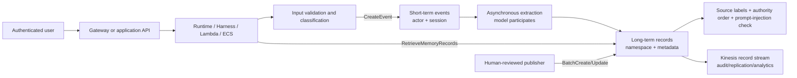
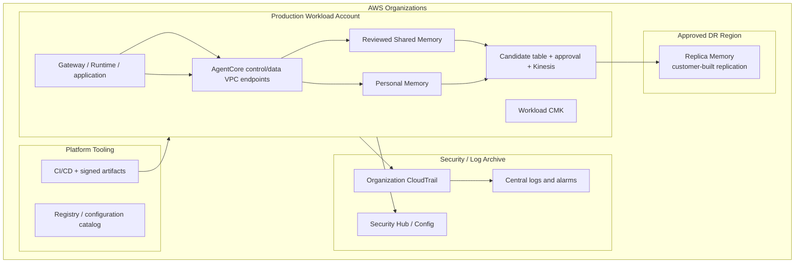

# AgentCore Memory Enterprise Governance Blueprint

> English translation. Chinese primary:
> [ENTERPRISE_GOVERNANCE_BLUEPRINT.md](ENTERPRISE_GOVERNANCE_BLUEPRINT.md).
> Research baseline: 2026-08-04. Recheck Regions, quotas, and prices for production decisions.

## 1. Position and Service Boundary

**Service boundary: AgentCore Memory is a regional, IAM-constrained data-plane
memory store with asynchronous extraction; the application maps trusted identities to
actor/session/namespace and decides what is eligible to be remembered.**

It solves:

- storing immutable short-term events under `memoryId + actorId + sessionId`;
- asynchronously producing cross-session records with built-in, override, or self-managed strategies;
- retrieving records by namespace, semantic query, and structured metadata;
- directly creating, updating, and deleting long-term records in batches and streaming lifecycle events to Kinesis;
- integration with enterprise controls through resource ARNs, IAM condition keys, KMS, and PrivateLink.

It does not solve:

- user authentication, business authorization, or proof of actor ownership;
- truth, PII/credential detection, prompt injection, or memory poisoning;
- shared-knowledge approval, conflict resolution, authority, or fact validity;
- document ingestion, hybrid retrieval, or reranking from Bedrock Knowledge Bases;
- native cross-Region replication, enterprise RTO/RPO, deletion propagation, or legal hold;
- Gateway tool catalogs, Policy Cedar decisions, or Runtime compute-session isolation.

### Five Key Concept Boundaries

| Concept | Correct definition | Common misconception |
|---|---|---|
| actor | Application-defined identity for a memory subject | Memory proves the actor is the current user |
| session | Grouping key for short-term events | The same as a Runtime microVM lifecycle |
| namespace | Long-term organization and retrieval scope that can enter IAM conditions | A string convention alone creates tenant isolation |
| event | Synchronously stored raw short-term record that can trigger extraction | Long-term knowledge ready for semantic retrieval |
| memory record | Long-term record produced by extraction or direct batch write | Business truth with approval or automatic invalidation |

Sources: [Memory organization](https://docs.aws.amazon.com/bedrock-agentcore/latest/devguide/memory-organization.html),
[CreateEvent](https://docs.aws.amazon.com/bedrock-agentcore/latest/APIReference/API_CreateEvent.html),
[BatchCreateMemoryRecords](https://docs.aws.amazon.com/bedrock-agentcore/latest/APIReference/API_BatchCreateMemoryRecords.html).

## 2. Control Plane, Data Plane, and Responsibility

| Plane | Main objects or APIs | Caller | Resource owner | Final control |
|---|---|---|---|---|
| Control | Memory, strategies, indexed keys, streams, KMS, tags | IaC deployment role | Workload AWS account | Organizations/SCP + IAM + CloudFormation/CDK |
| Short-term data | `CreateEvent`, `ListEvents`, `DeleteEvent` | Runtime, Harness, trusted bridge | Memory owner account | Memory ARN + actor/session conditions + identity mapping |
| Long-term data | `Retrieve/List/BatchCreate/BatchUpdate/BatchDeleteMemoryRecords` | Agent, publisher, operations tool | Memory owner account | Memory ARN + namespace conditions + metadata filters |
| Extraction | Built-in/override/self-managed strategy | AgentCore execution role | Memory owner account | Strategy, model permissions, pre-write checks |
| Events | Record streaming to Kinesis | AgentCore service role | Source account | Exact stream ARN, KMS, idempotent consumer |

**Deterministic infrastructure controls** include resource ARNs, IAM actions and condition
keys, KMS key policies, VPC endpoint policies, schemas, idempotency keys, and approval
state machines. **Model- or application-dependent behavior** includes actor mapping,
classification, extraction wording, relevance, conflict detection, authority ordering,
and whether to propose shared knowledge.

### Boundaries with Other Services

| Service | It owns | Memory still owns | Do not confuse |
|---|---|---|---|
| Gateway | Tool ingress, authentication, discovery, optional Policy interception | Event/record storage and Memory IAM | Gateway allow does not grant arbitrary actor reads |
| Runtime/Harness | Agent loop, compute session, protocol ingress | Persistent short- and long-term data | Runtime session is not Memory session |
| Identity | Workload/user credentials and delegation | Actor/namespace data boundary | Token success is not data authorization |
| Policy | Cedar/Guardrails decisions for Gateway calls | IAM decisions on Memory APIs | Policy does not intercept direct SDK calls |
| Observability | Traces, logs, metrics | Record content and lifecycle | Trace is not immutable business evidence |
| Registry | Design-time catalog, version, approval | Runtime memory data | Registry record is not a Memory record |
| Evaluations | Quality scoring | Data admission and access control | High score is not safety or truth |
| Knowledge Bases | Authoritative-document ingestion and retrieval | Interaction history and experiential memory | Memory must not override documents |
| Browser/Code Interpreter | Isolated execution and temporary files | Cross-session persistence | Sandbox end does not delete Memory |
| Bedrock model API | Inference and Guardrails | Storage, retrieval, lifecycle | Guardrails are not tenant isolation |

### Division with Traditional AWS Services

| Service | Responsibility | Memory boundary |
|---|---|---|
| Lambda / ECS / EKS | Host caller, validate identity/input, retry, business authorization | Memory does not run customer business logic |
| API Gateway | HTTP ingress, authorizer, WAF/rate limits, API lifecycle | Does not understand actor/namespace ownership |
| IAM / STS | Principal, temporary credentials, action/resource/condition decision | Memory enforces IAM but does not prove claim-to-actor mapping |
| KMS | Key policy, rotation, audit, crypto authorization | Key disable makes resource unavailable but is not deletion |
| Secrets Manager | Store and rotate external credentials | Secrets must not enter Memory, metadata, prompt, or logs |
| CloudWatch | Metrics, logs, alarms, queries | Caller adds correlation, redaction, and runbooks |
| CloudTrail | Control audit and supported data events | Test Memory data-plane coverage; do not assume full payload audit |
| VPC / PrivateLink | Private routing, DNS, SG, endpoint policy | Private path does not replace SigV4, IAM, or tenant authorization |
| S3 / DynamoDB / Kinesis | Evidence, approval state, immutable audit, record stream | Customer-built governance, not native Memory approval |

## 3. Enterprise Target Architecture

### Account, Region, Tenant, and Resource Boundaries

- **MUST** separate production, non-production, and security logs into different accounts; Runtime must not use the control-plane deployment role.
- **MUST** create Memory in a Region allowed by data classification and record the Region choice for Runtime, logs, KMS, and stream consumers.
- **MUST** separate Memory resources by environment and trust domain. Personal extraction and reviewed shared knowledge must not share a writer role.
- **SHOULD** prefer one resource per risk domain plus actor/namespace tenancy over one resource per tenant by default; the default 150 resources per account per Region constrains the latter.
- **MUST** use exact namespaces for high-risk shared reads; reserve `namespacePath` for approved hierarchical aggregation.
- **MUST** end namespaces with `/` to prevent prefix collisions.
- **MUST** treat cross-Region replication as a customer-built data pipeline. The official sample's STM dual-write and LTM stream replication are not a native DR guarantee.

See [Supported AWS Regions](https://docs.aws.amazon.com/bedrock-agentcore/latest/devguide/agentcore-regions.html).

## 4. Identity, Authentication, and Authorization

- **MUST** use temporary role credentials, never long-lived IAM user keys.
- **MUST** derive actor from a validated token or SigV4 principal; models, bodies, and tool parameters must not choose a privileged actor.
- **MUST** scope data-plane actions to exact Memory ARNs and split read, personal write, shared publish, delete, and operations roles.
- **MUST** use `bedrock-agentcore:actorId`, `bedrock-agentcore:sessionId`,
  `bedrock-agentcore:namespace`, or `bedrock-agentcore:namespacePath` where supported;
  do not use condition keys absent from the Service Authorization Reference.
- **MUST** add application actor-ownership checks where one Runtime role serves multiple users, with positive and negative tests. IAM cannot prove end-user ownership when it only sees a shared principal.
- **MUST** separate proposal, approval, publishing, and break-glass deletion; reviewers must not approve their own proposals.
- **SHOULD** bind stable user IDs into IAM with session or principal tags and prevent clients from changing them.
- **MAY** expose governed Memory tools through Gateway, but SCP/IAM must constrain direct SDK paths equally or Gateway remains bypassable.

Use the [Service Authorization Reference](https://docs.aws.amazon.com/service-authorization/latest/reference/list_bedrock-agentcore.html)
as authority for actions and condition keys.

## 5. Network and Private Connectivity

- **MUST** use AgentCore data and control interface endpoints for sensitive workloads:
  `com.amazonaws.<region>.bedrock-agentcore` and
  `com.amazonaws.<region>.bedrock-agentcore-control`.
- **MUST** validate endpoint policy, security group, routing, and DNS separately; PrivateLink changes the path but does not replace identity or authorization.
- **MUST** prefer SigV4 for private data-plane calls. Endpoint policies cannot restrict OAuth requests by OAuth user, so token validation and service authorization must compensate.
- **SHOULD** block workload subnets from reaching public AgentCore endpoints and prove it with DNS and flow-log negative tests.
- **SHOULD** review private paths for Kinesis, S3, DynamoDB, KMS, CloudWatch, and STS together so adjacent controls do not leak around private Memory.

Source: [AgentCore PrivateLink](https://docs.aws.amazon.com/bedrock-agentcore/latest/devguide/vpc-interface-endpoints.html).

## 6. Data Governance and Security

### Classification, Encryption, Retention, and Deletion

- **MUST** classify before write; credentials, tokens, keys, restricted PII, and unauthorized customer data must not enter events, metadata, records, traces, or logs.
- **MUST** use a customer managed KMS key for sensitive data, enable rotation, scope the key policy, and validate `kms:ViaService`, `aws:SourceAccount`, and applicable `aws:SourceArn`.
- **MUST** set `eventExpiryDuration` to the shortest business need (official range 7–365 days) and implement separate retention, deletion, legal hold, and data-subject workflows for long-term records.
- **MUST** propagate user deletion to events, records, stream consumers, audit copies, logs, Knowledge Bases, and downstream caches; run a quarterly deletion exercise.
- **MUST** not treat KMS key disable as normal deletion. It is a break-glass whole-resource availability switch.
- **SHOULD** retain `record_id`, source evidence, creation time, strategy, approver, and supersession links for provenance.

Sources: [Memory encryption](https://docs.aws.amazon.com/bedrock-agentcore/latest/devguide/storage-encryption.html),
[Security Hub control](https://docs.aws.amazon.com/securityhub/latest/userguide/bedrockagentcore-controls.html).

### Poisoning, Guardrails, and Human Intervention

- **MUST** treat every user-, tool-, and model-generated parameter as untrusted.
- **MUST** inspect content before storage and again before prompt injection; output-only filtering does not protect Memory.
- **MUST** use deterministic schema, evidence, and human review for team-shared knowledge; models must not have direct shared-write permission.
- **MUST** treat Guardrails as content-safety defense in depth, never business authorization or tenant isolation.
- **SHOULD** sample model-extracted records for review and monitor extraction volume, rejection rates, and anomalies.
- **MAY** use `extractionMode="SKIP"` when an event should not become long-term memory, while still governing it as short-term data.

## 7. Reliability, Idempotency, and Disaster Recovery

- **MUST** use stable idempotency keys for create, publish, replication, and delete; process record-level partial failures individually.
- **MUST** retry only throttling, service unavailability, and explicit transient errors; never retry `ValidationException`, `AccessDeniedException`, or wrong-tenant parameters.
- **MUST** set synchronous call timeouts and asynchronous extraction business deadlines; approval timeout must end safely, not remain `PENDING_REVIEW`.
- **MUST** degrade reads to "no memory" with an alarm; governed writes must never disappear silently.
- **MUST** consume record streams with at-least-once semantics and source-record-ID deduplication.
- **MUST** define STM/LTM RPO/RTO, replication lag, deletion propagation, strategy-ID mapping, failback, and dual-write conflict behavior.
- **SHOULD** exercise recovery quarterly; do not claim multi-Region HA before recovery validation.

Source: [Memory record streaming](https://docs.aws.amazon.com/bedrock-agentcore/latest/devguide/memory-record-streaming.html).

## 8. Quotas, Capacity, and Cost

Official snapshot as of 2026-08-04; never hard-code as permanent:

| Item | Current value | Governance action |
|---|---:|---|
| Memory resources/account/Region | 150, adjustable | Model environment and tenant growth |
| Strategies/Memory | 6, fixed | Combine or split during design |
| `CreateEvent` | 200 TPS, adjustable | Load test and pre-request |
| Conversational messages/actor/session | 5 TPS, fixed | Client limiting and batching |
| `RetrieveMemoryRecords` | 30 TPS, adjustable | Cache, budget, backoff |
| LTM extraction | 150,000 tokens/min, adjustable | Alarm on `TokenCount` |
| episodic/session extraction | 50,000 tokens/min, fixed | Bound session size |

Source: [AgentCore quotas](https://docs.aws.amazon.com/bedrock-agentcore/latest/devguide/bedrock-agentcore-limits.html).

| Charge | 2026-08-04 price | Main driver |
|---|---:|---|
| Short-term events | USD 0.25 / 1,000 new events | Turns, tool events, dual writes |
| Built-in strategy LTM | USD 0.75 / 1,000 records/month | Record count and retention |
| Override/self-managed LTM | USD 0.25 / 1,000 records/month | Plus model inference |
| LTM retrieval | USD 0.50 / 1,000 calls | Queries per turn and agents |

- **MUST** allocate cost with `Application`, `Environment`, `Owner`, `DataClass`, and `CostCenter` tags.
- **MUST** budget events, records, retrievals, extraction tokens, Kinesis, KMS, CloudWatch, and cross-Region replication together.
- **SHOULD** alarm on anomalous writes, retrieval storms, and extraction-token spikes.

Source: [AgentCore pricing](https://aws.amazon.com/bedrock/agentcore/pricing/).

## 9. Observability, Audit, and Incident Response

- **MUST** manage service-provided Metrics/Logs/Spans, application ADOT/OTEL, and the
  long-term analytical archive as three separate layers. Application trace does not
  replace service errors, and service metrics do not replace business steps.
- **MUST** confirm CloudWatch Transaction Search and OpenTelemetry span ingestion in every
  target account/Region. Record a telemetry gap when AgentCore service spans/traces are disabled.
- **MUST** explicitly configure Memory vended log delivery. Absence of configuration or
  events is not "no errors"; record destination, group/prefix, KMS, retention, and gap owner.
- **MUST** generate an end-to-end correlation ID across Gateway/Runtime, Memory calls, candidates, Step Functions, record IDs, and downstream stream events.
- **MUST** run one success and one controlled failure path per experiment and preserve
  independent Metrics, Logs, and Traces evidence. Discover exact namespace, metric, and
  dimensions from current target-Region documentation or CloudWatch.
- **MUST** enable organization CloudTrail management events and test actual CloudTrail visibility of Memory data APIs before launch. As of this baseline, no Memory page equivalent to the explicit Gateway data-event guide was found, so CloudTrail alone must not be claimed as complete content audit.
- **MUST** keep application access audit fields for principal, actor, session, namespace, action, result, error, and correlation ID; redact content by default.
- **MUST** encrypt logs and set retention; raw prompts, tokens, evidence, and retrieval results must not be logged by default.
- **MUST** alarm on API errors, throttling, extraction stops, `StreamPublishingFailure`,
  `StreamUserError`, backlog, telemetry silence, delivery/transform/table-commit failure,
  and anomalous cost.
- **MUST** maintain runbooks for poisoning, cross-tenant access, accidental deletion, KMS disable, stream interruption, and quota exhaustion.
- **SHOULD** use time-bounded, dual-approved, alerted, post-reviewed break-glass roles.

See [OBSERVABILITY_BLUEPRINT.en.md](OBSERVABILITY_BLUEPRINT.en.md) for cross-service
defaults, resource matrix, evidence template, and the CloudWatch Logs -> Firehose ->
S3 Tables long-term analytics design.

## 10. IaC, Release, and Lifecycle

- **MUST** manage Memory, KMS, IAM, endpoints, logs, and streams with CloudFormation/CDK; prohibit production console drift.
- **MUST** run synth, IAM wildcard checks, retention checks, bilingual checks, and negative tests in CI.
- **MUST** treat indexed keys as irreversible schema decisions and design migration and rollback first.
- **MUST** pin supported SDK and AgentCore client versions with service models for the metadata and batch APIs in use.
- **MUST** export required audit evidence, stop writes, drain streams, propagate deletion, and confirm retained resources will not block replacement before deleting Memory.
- **SHOULD** migrate Memory blue/green: dual-write, backfill, compare, switch reads, stop old writes, observe, retire.

CloudFormation resource:
[AWS::BedrockAgentCore::Memory](https://docs.aws.amazon.com/AWSCloudFormation/latest/TemplateReference/aws-resource-bedrockagentcore-memory.html).

## 11. RACI

| Activity | Platform | Application | Security | Data owner | Operations/SRE |
|---|---|---|---|---|---|
| Account, Region, endpoint | A/R | C | C | I | C |
| Actor/session mapping | C | A/R | C | C | I |
| Memory schema and strategy | C | R | C | A | I |
| IAM/KMS/SCP | R | C | A | I | C |
| Content admission and review | C | R | C | A | I |
| Monitoring and incidents | C | C | C | I | A/R |
| Retention, deletion, legal hold | C | R | C | A | R |
| Cost and quota | A | R | I | C | R |
| Exception approval | C | C | A | A | I |

`A` is accountable, `R` responsible, `C` consulted, and `I` informed. Each activity needs
one clear accountable owner; the dual `A` for exceptions requires joint Security and
Data-owner approval.

## 12. Maturity Model

| Level | Description | Exit criterion |
|---|---|---|
| L0 experiment | Shared credentials, no boundary, no cleanup | Must not touch enterprise data |
| L1 foundation | IaC, separate environments, minimum retention | Rebuild and cleanup demonstrated |
| L2 isolation | Actor/namespace IAM, CMK, negative tests | Cross-tenant and unauthorized tests pass |
| L3 governance | Inspection, approval, evidence, deletion propagation | Evidence exists for every baseline MUST |
| L4 operations | SLO, quota, cost, DR, incident exercises | Recovery and deletion exercises pass |
| L5 continuous assurance | Red team, access review, drift detection, quality gates | Quarterly evidence pack and expired exceptions closed |

## 13. Cross-Service Contract with Gateway

| Contract | Gateway responsibility | Memory responsibility | Caller responsibility | Evidence |
|---|---|---|---|---|
| Identity propagation | Validate ingress token and carry stable subject/context | Accept SigV4 principal and condition context | Map subject to actor; reject model parameter | Token tests, IAM simulator, negative calls |
| Final authorization | Decide whether tool is callable | Final IAM decision on Memory ARN/action/condition | Business authorization and actor ownership | CloudTrail, application audit, 403/AccessDenied |
| Network path | Govern tool ingress and optional private target | Control/data PrivateLink | Block bypass and configure DNS/SG | VPC flow log, endpoint policy |
| Data classification | Validate tool schema; optional Policy/Guardrails | Store submitted events and records | Pre-write classification and pre-prompt check | Labels and blocking tests |
| Session/state | Manage MCP/HTTP session | Store events by actor/session | Define ID mapping and end semantics | Mapping and cross-session tests |
| Retry/idempotency | Preserve request correlation and errors | Support client/request identifiers | Classify errors and use stable keys | Replay test, no duplicate record |
| Logs/Trace | Record ingress and tool call | Publish metrics, ingestion logs, stream events | Unified correlation ID and redaction | End-to-end trace query |
| Quota/cost | Limit tool calls and ingress rate | Enforce and bill Memory quotas | Budget, cache, batch, backoff | Quota snapshot, budget alarm |
| Version/compatibility | Pin tool schema and target version | Pin API/SDK/schema | Contract tests and migration | Release checklist, rollback record |
| Failure/rollback | Circuit-break or disable target | Return explicit error, no application rollback | Degrade without memory, stop writes, switch version | Fault injection, runbook exercise |

Additional checks:

- whether authorization or Guardrails rules are duplicated between Gateway and application and drift;
- whether an agent can bypass Gateway with direct Memory permission;
- whether Gateway subject-to-actor mapping is lost, defaulted, or elevated;
- whether Gateway request IDs join to Memory events/records and approval evidence;
- whether session end, user revocation, or resource deletion propagates to Memory lifecycle.

## 14. Architecture Review Questions

1. Which validated claim derives actor, and who proves ownership?
2. Why one Memory rather than separation by environment, risk domain, or authority tier?
3. Which actions can directly write long-term records, and who holds them?
4. Is namespace exact or hierarchical, and what does the negative test prove?
5. What may never enter events, records, metadata, or logs?
6. How do extraction failure, read failure, approval timeout, and batch partial failure converge?
7. When is a record expired, superseded, deleted, retained, or legally held?
8. Can a direct SDK path bypass Gateway/Policy/Guardrails?
9. What STM/LTM loss is acceptable in a Region failure, and who owns replication/failback?
10. Does the quota and cost model include peak, dual-write, streams, logs, and model inference?
11. Can a user request be traced to event, record, approver, evidence, and downstream copy?
12. How is complete deletion and policy-compliant audit retention proven at retirement?

## 15. Sources and Fact Labels

- **AWS service facts**: Developer Guide, API Reference, Service Authorization Reference,
  Release Notes, Pricing, Quotas, Regions, and CloudFormation.
- **AWS recommendations**: security reference architecture, Security Hub/Config controls, and official production checklist.
- **Local experimental facts**: [实验报告](实验报告.md) and [桌面客户端集成设计](桌面客户端集成设计.md).
- **Blueprint recommendations**: separate Memory resources, reviewed shared writes, authority ordering, cross-service contracts, and maturity gates.

See [AWS_SAMPLE_CATALOG.en.md](AWS_SAMPLE_CATALOG.en.md) for the pinned sample snapshot,
[CONTROL_BASELINE.en.md](CONTROL_BASELINE.en.md) for auditable requirements, and
[../experiments/README.en.md](../experiments/README.en.md) for execution.
