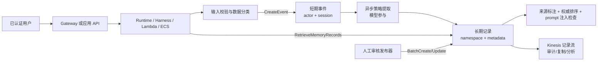
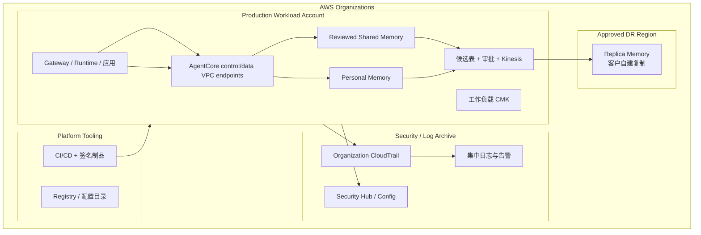

# AgentCore Memory 企业治理蓝图

> 主版本：中文。English: [ENTERPRISE_GOVERNANCE_BLUEPRINT.en.md](ENTERPRISE_GOVERNANCE_BLUEPRINT.en.md)。
> 调研基准：2026-08-04。本文中的 Region、配额和价格必须在生产决策时重新核验。

## 1. 定位与服务边界

**服务边界：AgentCore Memory 是区域性的、由 IAM 约束的数据面记忆存储与异步提取
服务；应用负责把可信身份映射为 actor/session/namespace，并决定什么内容有资格被记住。**

它解决：

- 以 `memoryId + actorId + sessionId` 保存短期不可变事件；
- 通过内置、override 或自管策略异步形成跨会话长期记录；
- 按 namespace、语义查询和结构化元数据检索长期记录；
- 直接批量创建、更新和删除长期记录，并以 Kinesis 推送记录生命周期事件；
- 以资源 ARN、IAM condition key、KMS 和 PrivateLink 接入企业控制面。

它不解决：

- 用户认证、业务授权和 actor 归属证明；
- 内容真实性、PII/凭据检测、提示词注入和记忆投毒；
- 共享知识的审批、冲突裁决、权威等级和事实有效期；
- Bedrock Knowledge Bases 的文档摄取、混合检索或重排；
- 原生跨 Region 复制、企业 RTO/RPO、删除传播和法律保留；
- Gateway 的工具目录、Policy 的 Cedar 决策或 Runtime 的会话计算隔离。

### 五组关键概念边界

| 概念 | 正确定义 | 常见误解 |
|---|---|---|
| actor | 由应用定义的记忆主体标识 | Memory 会验证 actor 就是当前用户 |
| session | 短期事件的会话分组键 | 等同于 Runtime 微虚机生命周期 |
| namespace | 长期记录的组织与检索范围，可进入 IAM 条件 | 仅靠字符串约定即可完成租户隔离 |
| event | 同步写入的原始短期记录，可触发异步提取 | 已可被语义检索的长期知识 |
| memory record | 提取或直接批量写入的长期记录 | 具备业务真值、审批状态或自动失效语义 |

来源：[Memory organization](https://docs.aws.amazon.com/bedrock-agentcore/latest/devguide/memory-organization.html)、
[CreateEvent](https://docs.aws.amazon.com/bedrock-agentcore/latest/APIReference/API_CreateEvent.html)、
[BatchCreateMemoryRecords](https://docs.aws.amazon.com/bedrock-agentcore/latest/APIReference/API_BatchCreateMemoryRecords.html)。

## 2. 控制面、数据面和责任模型

| 层面 | 主要对象或 API | 调用者 | 资源 owner | 最终控制 |
|---|---|---|---|---|
| 控制面 | Memory 资源、策略、indexed keys、流配置、KMS、标签 | IaC 发布角色 | 工作负载 AWS 账户 | Organizations/SCP + IAM + CloudFormation/CDK |
| 短期数据面 | `CreateEvent`、`ListEvents`、`DeleteEvent` | Runtime、Harness、受信 bridge | Memory owner 账户 | Memory ARN + actor/session 条件 + 应用身份映射 |
| 长期数据面 | `Retrieve/List/BatchCreate/BatchUpdate/BatchDeleteMemoryRecords` | Agent、发布器、运维工具 | Memory owner 账户 | Memory ARN + namespace 条件 + 元数据过滤 |
| 提取面 | 内置/override/自管策略 | AgentCore 服务执行角色 | Memory owner 账户 | 策略配置、模型权限、应用写入前检查 |
| 事件面 | record streaming 到 Kinesis | AgentCore 服务角色 | 源账户 | 精确 stream ARN、KMS、幂等消费方 |

**确定性基础设施控制**包括资源 ARN、IAM action、condition key、KMS key policy、VPC endpoint
policy、schema、幂等键和审批状态机。**仍依赖模型或应用代码**的包括 actor 映射、内容分类、
提取措辞、相关性排序、冲突识别、权威优先级和是否提出共享知识候选。

### 与其他服务的责任边界

| 服务 | 它负责 | Memory 仍负责 | 不应混淆 |
|---|---|---|---|
| Gateway | 工具入口、认证、工具发现、可选 Policy 拦截 | 事件/记录存储和 Memory IAM | Gateway 通过不代表可读任意 actor |
| Runtime/Harness | 执行 agent loop、会话计算、协议入口 | 持久短期/长期数据 | Runtime session 不是 Memory session |
| Identity | workload/user 凭证与委托 | actor/namespace 数据边界 | token 获取成功不是数据授权 |
| Policy | Gateway 工具调用的 Cedar/Guardrails 决策 | Memory API 的 IAM 决策 | Policy 不自动拦截 Memory SDK 调用 |
| Observability | trace、日志、指标 | 记录内容和生命周期 | trace 不能替代不可变业务证据 |
| Registry | 设计时资产目录、版本和审批 | 运行时记忆数据 | Registry 记录不是 Memory record |
| Evaluations | 质量评估 | 数据准入与访问控制 | 高评分不意味着安全或真实 |
| Knowledge Bases | 权威文档摄取与检索 | 交互历史和经验记忆 | 记忆不得覆盖权威文档 |
| Browser/Code Interpreter | 隔离执行与临时文件 | 跨会话持久化 | 沙箱结束不删除 Memory 数据 |
| Bedrock 模型 API | 推理与 Guardrails | 存储、检索、生命周期 | Guardrails 不是租户隔离 |

### 与传统 AWS 服务的分工

| 服务 | 责任 | Memory 边界 |
|---|---|---|
| Lambda / ECS / EKS | 承载调用方、校验身份和输入、执行重试与业务授权 | Memory 不运行客户业务逻辑 |
| API Gateway | HTTP 入口、认证器、WAF/限流和 API 生命周期 | 不理解 actor/namespace 的数据所有权 |
| IAM / STS | principal、临时凭证、action/resource/condition 决策 | Memory 执行 IAM 结果，不证明 claim 到 actor 的业务映射 |
| KMS | key policy、轮换、审计和加解密授权 | key disable 会使资源不可用，但不等同于删除 |
| Secrets Manager | 保存并轮换外部凭据 | secret 不得写入 Memory、metadata、prompt 或日志 |
| CloudWatch | 指标、日志、告警和查询 | 需要调用方补 correlation、脱敏和 runbook |
| CloudTrail | 控制面审计及已支持的数据事件 | 上线前必须实测 Memory 数据面覆盖，不能假定完整 payload 审计 |
| VPC / PrivateLink | 私网路由、DNS、SG 和 endpoint policy | 私网不替代 SigV4、IAM 或租户授权 |
| S3 / DynamoDB / Kinesis | 证据、审批状态、不可变审计和记录流 | 这些是客户自建治理层，不是 Memory 原生审批能力 |

## 3. 企业目标架构

### 账户、Region、租户和资源边界

- **MUST** 将生产、非生产和安全日志置于独立账户；控制面发布角色不得被 Runtime 使用。
- **MUST** 在数据分类允许的 Region 创建 Memory，并将 Runtime、日志、KMS 和流式消费者的
  Region 选择记录为架构决策。
- **MUST** 按环境和信任域拆 Memory 资源。个人自动提取与人工审核共享知识不得共用写角色。
- **SHOULD** 采用“每风险域一个资源 + actor/namespace 分租户”，而不是默认每租户一个资源；
  默认每账户每 Region 150 个 Memory 资源会限制后一方案。
- **MUST** 对高风险共享读取使用精确 namespace；`namespacePath` 只用于已批准的层级聚合。
- **MUST** 让 namespace 以 `/` 结尾，避免前缀碰撞。
- **MUST** 把跨 Region 复制视为客户自建数据管道。官方 sample 的 STM 双写和 LTM 流复制
  不是服务原生 DR 保证。

当前 Memory Region 列表见
[Supported AWS Regions](https://docs.aws.amazon.com/bedrock-agentcore/latest/devguide/agentcore-regions.html)。

## 4. 身份、认证和授权

- **MUST** 使用短期角色凭证，不使用 IAM user 长期密钥。
- **MUST** 从已验证 token 或 SigV4 principal 派生 actor；模型、请求体和工具参数不得自行
  指定越权 actor。
- **MUST** 将数据面 action 限定到精确 Memory ARN，并按操作拆分读、个人写、共享发布、
  删除和运维角色。
- **MUST** 在支持的 API 上使用 `bedrock-agentcore:actorId`、
  `bedrock-agentcore:sessionId`、`bedrock-agentcore:namespace` 或
  `bedrock-agentcore:namespacePath`；不得引用未在 Service Authorization Reference
  核实的 condition key。
- **MUST** 对“共享 Runtime 角色服务多个用户”的路径增加应用层 actor 归属校验，并做正向
  与负向测试。IAM 只看到共享 principal 时不能证明最终用户归属。
- **MUST** 分离提案、审批、发布和 break-glass 删除职责；审批人不得批准自己的提案。
- **SHOULD** 用 session tag 或 principal tag 将稳定用户 ID 绑定进 IAM 条件，并禁止客户端
  修改该标签。
- **MAY** 通过 Gateway 暴露受治理的 Memory 工具，但直接 SDK 路径必须被 SCP/IAM 同样约束，
  否则 Gateway 可被绕过。

权威 action 与 condition key 以
[Service Authorization Reference](https://docs.aws.amazon.com/service-authorization/latest/reference/list_bedrock-agentcore.html)
为准。

## 5. 网络和私有连接

- **MUST** 对敏感工作负载使用 AgentCore 数据面与控制面 interface endpoint：
  `com.amazonaws.<region>.bedrock-agentcore` 和
  `com.amazonaws.<region>.bedrock-agentcore-control`。
- **MUST** 在 endpoint policy、security group、路由和 DNS 四处分别验证限制；PrivateLink
  只改变网络路径，不替代身份和授权。
- **MUST** 优先使用 SigV4 调用私网数据面。OAuth 请求通过 endpoint 时，endpoint policy
  无法按 OAuth 用户限制 principal，必须由 token 校验和服务授权补偿。
- **SHOULD** 禁止工作负载子网直连公网 AgentCore endpoint，并通过 DNS/流日志负向证明。
- **SHOULD** 将 Kinesis、S3、DynamoDB、KMS、CloudWatch 和 STS 的私网路径纳入同一数据流
  评审，避免 Memory 私网但周边控制外泄。

来源：[AgentCore PrivateLink](https://docs.aws.amazon.com/bedrock-agentcore/latest/devguide/vpc-interface-endpoints.html)。

## 6. 数据治理和安全

### 分类、加密、保留与删除

- **MUST** 在写入前分类；凭据、token、密钥、受限 PII 和未经授权的客户数据不得进入 event、
  metadata、record、trace 或日志。
- **MUST** 对敏感数据使用 customer managed KMS key，启用轮换，收敛 key policy，并验证
  `kms:ViaService`、`aws:SourceAccount` 和适用的 `aws:SourceArn`。
- **MUST** 将 `eventExpiryDuration` 设为业务最短需要值（官方范围 7–365 天），并为长期记录
  单独实现保留、删除、法律保留和数据主体请求流程。
- **MUST** 让用户删除传播到短期事件、长期记录、流消费者、审计副本、日志、Knowledge Base
  和下游缓存；每季度做一次删除演练。
- **MUST** 不把 KMS key disable 当作正常删除。它是破窗式全资源不可用开关。
- **SHOULD** 记录 `record_id`、来源 evidence、创建时间、策略、批准人和取代关系，支持追溯。

来源：[Memory encryption](https://docs.aws.amazon.com/bedrock-agentcore/latest/devguide/storage-encryption.html)、
[Security Hub control](https://docs.aws.amazon.com/securityhub/latest/userguide/bedrockagentcore-controls.html)。

### 投毒、Guardrails 和人工介入

- **MUST** 把所有用户、工具和模型生成参数视为不可信输入。
- **MUST** 在存储前和注入 prompt 前各执行一次内容检查；只过滤模型输出不能保护 Memory。
- **MUST** 对团队共享层使用确定性 schema、证据引用和人工审核；模型不得拥有共享直写权限。
- **MUST** 将 Guardrails 视为内容安全补充，不得作为业务授权或租户隔离。
- **SHOULD** 对模型抽取记录进行采样复核，并监控提取量、拒绝率和异常增长。
- **MAY** 对无需长期提取的事件使用 `extractionMode="SKIP"`，但仍按短期数据处理。

## 7. 可靠性、幂等和灾难恢复

- **MUST** 为创建、发布、复制和删除使用稳定幂等键；对记录级部分失败逐项处理。
- **MUST** 只重试限流、服务不可用和明确的瞬时错误；不得重试
  `ValidationException`、`AccessDeniedException` 或错误租户参数。
- **MUST** 为同步 API 设置调用超时，为异步提取设置业务等待上限；审核超时必须收敛为安全
  终态，不能永久 `PENDING_REVIEW`。
- **MUST** 让读取失败降级为“无记忆”且带告警；受治理写入失败不得静默丢失。
- **MUST** 以至少一次语义消费 record stream，并用来源 record ID 去重。
- **MUST** 在 DR 设计中明确 STM 与 LTM 的 RPO/RTO、复制延迟、删除传播、策略 ID 映射、
  failback 和双写冲突。
- **SHOULD** 每季度执行恢复演练；未完成恢复验证前不得声明多 Region 高可用。

来源：[Memory record streaming](https://docs.aws.amazon.com/bedrock-agentcore/latest/devguide/memory-record-streaming.html)。

## 8. 配额、容量和成本

以下为 2026-08-04 官方快照，不得硬编码为永久值：

| 项目 | 当前值 | 治理动作 |
|---|---:|---|
| Memory 资源/账户/Region | 150，可调 | 容量模型纳入环境与租户增长 |
| 策略/Memory | 6，不可调 | 在设计期合并或拆分策略 |
| `CreateEvent` | 200 TPS，可调 | 压测并预申请 |
| 会话消息/actor/session | 5 TPS，不可调 | 客户端限流与批量设计 |
| `RetrieveMemoryRecords` | 30 TPS，可调 | 缓存、预算、退避 |
| LTM 提取 | 150,000 tokens/min，可调 | `TokenCount` 告警 |
| episodic/session 提取 | 50,000 tokens/min，不可调 | 控制会话规模 |

来源：[AgentCore quotas](https://docs.aws.amazon.com/bedrock-agentcore/latest/devguide/bedrock-agentcore-limits.html)。

| 计费项 | 2026-08-04 单价 | 主要驱动 |
|---|---:|---|
| 短期事件 | USD 0.25 / 1,000 新事件 | 回合数、工具事件、双写 |
| 内置策略 LTM | USD 0.75 / 1,000 记录/月 | 记录数量与保留期 |
| override/自管 LTM | USD 0.25 / 1,000 记录/月 | 另加模型推理 |
| LTM 检索 | USD 0.50 / 1,000 次 | 每轮查询次数、agent 数 |

- **MUST** 按 `Application`、`Environment`、`Owner`、`DataClass`、`CostCenter` 标签分配成本。
- **MUST** 建立事件数、记录数、检索数、提取 token、Kinesis、KMS、CloudWatch 和跨 Region
  复制的联合预算。
- **SHOULD** 对异常写入、检索风暴和提取 token 激增告警。

来源：[AgentCore pricing](https://aws.amazon.com/bedrock/agentcore/pricing/)。

## 9. 可观测性、审计和事件响应

- **MUST** 将 service-provided Metrics/Logs/Spans、应用 ADOT/OTEL 和长期分析归档作为三个
  独立层管理；不得用应用 trace 代替服务错误，也不得用服务指标代替业务步骤。
- **MUST** 在每个目标账户/Region 确认 CloudWatch Transaction Search 与 OpenTelemetry
  span ingestion 状态；AgentCore service spans/traces 未启用时必须记录遥测缺口。
- **MUST** 显式配置 Memory vended log delivery。未配置或未出现事件时不得写“没有错误”；
  应记录 destination、log group/prefix、KMS、retention 与缺口 owner。
- **MUST** 生成端到端 correlation ID，并贯穿 Gateway/Runtime、Memory 调用、候选项、
  Step Functions、record ID 和下游流事件。
- **MUST** 每项实验执行一个成功路径和一个受控失败路径，并分别保存 Metrics、Logs、Traces
  证据；精确 namespace、metric 与 dimensions 从目标 Region 当前文档或 CloudWatch 发现。
- **MUST** 启用组织级 CloudTrail 管理事件，并在上线前实测 Memory 数据面 API 的实际
  CloudTrail 可见性；截至本基准日，未找到与 Gateway 同等明确的 Memory 数据事件配置页，
  因此不得只依赖 CloudTrail 声称完整内容审计。
- **MUST** 记录应用级访问审计：主体、actor、session、namespace、action、结果、错误码和
  correlation ID；内容默认脱敏。
- **MUST** 加密日志并设置保留期；原始 prompt、token、证据内容和检索结果不得默认进入日志。
- **MUST** 对 API 错误、限流、提取中断、`StreamPublishingFailure`、
  `StreamUserError`、积压、遥测静默、delivery/transform/table commit 失败和异常成本告警。
- **MUST** 建立投毒、跨租户读取、误删、KMS disable、流中断和配额耗尽 runbook。
- **SHOULD** 为 break-glass 使用限时角色、双人批准、告警和事后复核。

跨服务的默认信号、资源矩阵、证据模板，以及 CloudWatch Logs -> Firehose -> S3 Tables
长期分析设计见[OBSERVABILITY_BLUEPRINT.md](OBSERVABILITY_BLUEPRINT.md)。

## 10. IaC、发布和生命周期

- **MUST** 用 CloudFormation/CDK 管理 Memory、KMS、IAM、endpoint、日志和流配置；禁止生产
  控制台漂移。
- **MUST** 在 CI 中执行 synth、IAM 通配符检查、资源保留策略检查、文档双语检查和负向测试。
- **MUST** 将 indexed keys 视为不可逆 schema 决策；变更前做迁移与回滚设计。
- **MUST** 为 SDK 和 AgentCore client 固定受支持版本；服务模型必须包含所用 metadata 和
  batch API。
- **MUST** 在删除 Memory 前导出必要审计证据、停写、排空流、完成删除传播并确认 retained
  资源不会阻塞重建。
- **SHOULD** 采用蓝绿 Memory 迁移：双写、回填、比对、切读、停旧写、保留观察、再退役。

CloudFormation 资源：
[AWS::BedrockAgentCore::Memory](https://docs.aws.amazon.com/AWSCloudFormation/latest/TemplateReference/aws-resource-bedrockagentcore-memory.html)。

## 11. RACI

| 活动 | 平台团队 | 应用团队 | 安全团队 | 数据 owner | 运维/SRE |
|---|---|---|---|---|---|
| 账户、Region、endpoint | A/R | C | C | I | C |
| actor/session 映射 | C | A/R | C | C | I |
| Memory schema 与策略 | C | R | C | A | I |
| IAM/KMS/SCP | R | C | A | I | C |
| 内容准入与审批 | C | R | C | A | I |
| 监控与事件响应 | C | C | C | I | A/R |
| 保留、删除、法律保留 | C | R | C | A | R |
| 成本与配额 | A | R | I | C | R |
| 例外批准 | C | C | A | A | I |

`A` 为最终负责，`R` 为执行，`C` 为协商，`I` 为知会。每项必须只有一个明确的最终负责
角色；表中的双 `A` 例外批准要求安全与数据 owner 共同批准。

## 12. 成熟度模型

| 级别 | 描述 | 退出标准 |
|---|---|---|
| L0 实验 | 共享凭证、无边界、无清理 | 不得接触企业数据 |
| L1 基础 | IaC、独立环境、最小保留 | 资源可重建且可清理 |
| L2 隔离 | actor/namespace IAM、CMK、负向测试 | 跨租户和越权测试通过 |
| L3 治理 | 内容检查、审批、证据、删除传播 | 控制基线所有 MUST 有证据 |
| L4 运营 | SLO、配额、成本、DR、事件演练 | 恢复与删除演练通过 |
| L5 持续保证 | 红队、访问复核、漂移检测、质量门禁 | 季度证据包和例外到期闭环 |

## 13. 与 Gateway 的跨服务契约

| 契约 | Gateway 责任 | Memory 责任 | 调用方责任 | 证据 |
|---|---|---|---|---|
| 身份传播 | 验证入口 token，传递稳定 subject/context | 接受 SigV4 principal 和条件上下文 | 将 subject 映射为 actor，不信任模型参数 | token 测试、IAM simulator、负向调用 |
| 最终授权 | 控制工具是否可调用 | 对 Memory ARN/action/condition 做最终 IAM 决策 | 业务授权与 actor 归属校验 | CloudTrail、应用审计、403/AccessDenied |
| 网络路径 | 提供受控工具入口和可选私网目标 | 提供 control/data PrivateLink | 禁止绕过路径，配置 DNS/SG | VPC flow log、endpoint policy |
| 数据分类 | 校验工具 schema，可做 Policy/Guardrails | 保存传入事件和记录 | 写前分类、读后注入检查 | 分类标签、阻断测试 |
| 会话/状态 | 管理 MCP/HTTP 会话 | 按 actor/session 保存事件 | 明确定义 ID 映射与结束语义 | 映射表、跨会话测试 |
| 重试/幂等 | 保留请求关联和错误 | 支持 client/request identifier | 分类错误、稳定幂等键 | 重放测试、无重复记录 |
| 日志/Trace | 记录入口与工具调用 | 发布指标、摄取日志和流事件 | 统一 correlation ID、脱敏 | 端到端 trace 查询 |
| 配额/成本 | 限制工具调用和入口速率 | 执行 Memory 配额并计费 | 预算、缓存、批量和退避 | 配额快照、预算告警 |
| 版本/兼容 | 固定工具 schema 和 target 版本 | 固定 API/SDK/schema | 契约测试和迁移 | 发布清单、回滚记录 |
| 故障与回滚 | 熔断或禁用 target | 返回明确错误，不保证应用回滚 | 降级无记忆、停写、切换版本 | 故障注入、runbook 演练 |

必须额外检查：

- 同一 Guardrails/授权规则是否在 Gateway 和应用重复且发生漂移；
- agent 是否能绕过 Gateway 直接持有 Memory 权限；
- Gateway subject 到 actor 的映射是否丢失、默认化或被提升；
- Gateway request ID 是否能关联到 Memory event/record 和审批证据；
- Gateway 会话结束、用户吊销或资源删除是否传播到 Memory 生命周期。

## 14. 架构评审问题

1. actor 由哪个已验证 claim 派生，谁证明调用者拥有它？
2. 为什么选择一个 Memory 资源，而不是按环境、风险域或权威层拆分？
3. 哪些 action 可直接写长期记录，谁持有这些 action？
4. namespace 是精确匹配还是层级匹配，负向测试证明了什么？
5. 哪些内容不得进入短期事件、长期记录、metadata 和日志？
6. 提取失败、读取失败、审批超时和部分批量失败分别如何收敛？
7. 记录何时过期、被取代、删除、保留或进入法律冻结？
8. 直接 SDK 路径能否绕过 Gateway/Policy/Guardrails？
9. 单 Region 故障时允许丢失多少 STM/LTM，谁负责复制与 failback？
10. 配额和成本模型是否覆盖峰值、双写、流、日志和模型推理？
11. 能否从用户请求追到 event、record、审批人、证据和下游副本？
12. 退役时如何证明所有副本已删除且审计证据仍按政策保留？

## 15. 来源与事实标签

- **AWS 服务事实**：Developer Guide、API Reference、Service Authorization Reference、
  Release Notes、Pricing、Quotas、Regions 和 CloudFormation。
- **AWS 推荐**：安全参考架构、Security Hub/Config 控制及官方 production checklist。
- **本地实验事实**：[实验报告](实验报告.md)与[桌面客户端集成设计](桌面客户端集成设计.md)。
- **本蓝图建议**：双 Memory 资源、共享写审批、权威排序、跨服务契约和成熟度门禁。

完整官方样例快照和漂移记录见[AWS_SAMPLE_CATALOG.md](AWS_SAMPLE_CATALOG.md)；可审计要求见
[CONTROL_BASELINE.md](CONTROL_BASELINE.md)；执行路线见
[../experiments/README.md](../experiments/README.md)。
