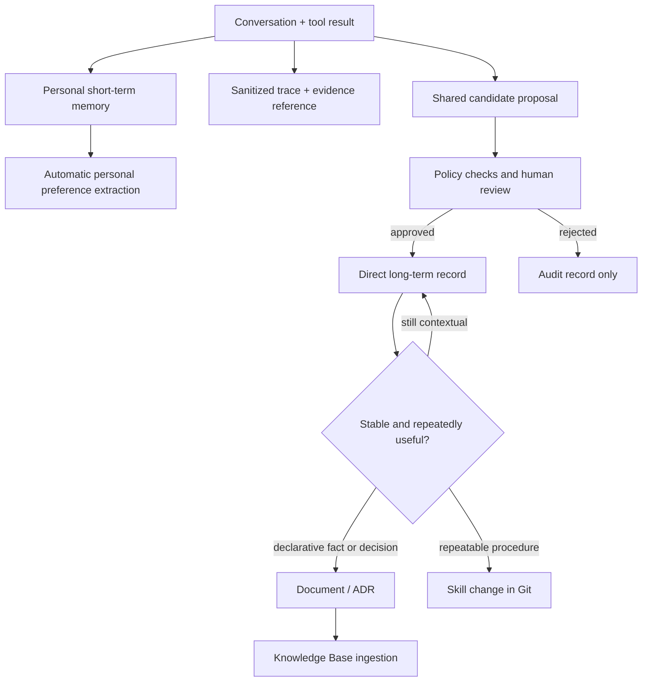

# Architecture and Knowledge Boundaries

## Design Goals

- Multi-user project with isolated personal preferences.
- Shared memory visible to all project members only after review.
- No direct retrieval from raw logs.
- Every shared record is traceable to evidence and an approver.
- Stable knowledge can be promoted to managed documents or versioned Skills.
- Runtime retrieval follows a deterministic precedence policy.

## Identity Model

| Scope | Resource | Actor ID | Session ID | Namespace |
|---|---|---|---|---|
| Personal conversation | Personal Memory | `user:<subject>` | conversation ID | short-term event scope |
| Personal preference | Personal Memory | `user:<subject>` | source conversation | `/users/{actorId}/preferences/` |
| Session summary | Personal Memory | `user:<subject>` | conversation ID | `/users/{actorId}/sessions/{sessionId}/summary/` |
| Shared project knowledge | Shared Memory | Synthetic project ownership | Not applicable to direct records | `/projects/project:<project_id>/shared/` |

The application derives `subject` from the immutable Cognito `sub` claim and derives
project membership from authenticated claims. Clients never supply an arbitrary actor
ID or project namespace. The synthetic `project:<project_id>` segment is an
organizational convention for direct long-term records; it is not a security principal.

## Knowledge Layers

| Layer | Purpose | Authority | Directly retrieved by agent |
|---|---|---|---|
| Logs and traces | Evidence, debugging, evaluation | Observational | No |
| Short-term memory | Conversation continuity | Raw interaction | Current session only |
| Personal long-term memory | User preferences | User-scoped, extracted | Yes, only for that user |
| Shared long-term memory | Reviewed project experience | Project-scoped, reviewed | Yes, for project members |
| Managed Knowledge Base | Authoritative documents and durable facts | Document owner | Yes |
| Team Skills | Executable procedures and tool policy | Git review and tests | Loaded by trigger |

Knowledge Base is a retrieval mechanism over authoritative documents. Skills are
versioned operational behavior. Shared memory fills the gap for useful, reviewed
experience that has not yet become either.

## Information Lifecycle

Promotion is not copying raw conversation. It creates a new, owned artifact with a
source reference, reviewer, effective date, and lifecycle.

## Runtime Retrieval Policy

The data analysis agent builds context in this order:

1. Live APIs, current datasets, and tool results.
2. Team Skills and code/configuration in Git.
3. Managed Knowledge Base documents.
4. Approved project shared memory.
5. Personal preference memory.
6. Model inference.

Higher layers override conflicting lower layers. Memory must never override current
data or an authoritative document.

## Review Policy

A candidate must contain:

- project ID and candidate ID;
- concise, independently understandable statement;
- category: `fact`, `decision`, `constraint`, `incident`, or `procedure_hint`;
- evidence reference to a trace or immutable log record;
- proposer user ID;
- confidence and privacy classification;
- proposed expiration date when the information is temporary.

Candidates containing raw credentials, restricted data, or direct personal
information are rejected before human review. Approval calls
`BatchCreateMemoryRecords` with `requestIdentifier=candidate_id`. This stores the
reviewed statement unchanged, avoids a second model extraction, and returns the
long-term `memoryRecordId` for the audit record. The direct record is eventually
consistent for retrieval.

The shared Memory resource declares immutable indexed keys for `project_id`,
`category`, `review_status`, and `promotion_hint`. Runtime retrieval uses both the
exact project namespace and metadata filters for `project_id` and
`review_status=approved`. `candidate_id` remains non-indexed metadata and links the
record to the DynamoDB audit item containing evidence and reviewer identity.

## Permissions

| Role | Personal Memory | Shared Memory | Candidate table | Task token |
|---|---|---|---|---|
| Agent runtime | Own actor read/write | Retrieve only | Propose through EventBridge | None |
| Review workflow | None | None | Read/write workflow state | Create callback |
| Reviewer API | None | None | Project reviewer group only | Consume once |
| Shared publisher | None | `BatchCreateMemoryRecords` in one project namespace | Read approved candidate | None |
| Operations | Break-glass/audited | Break-glass/audited | Audited read | None |

The stack applies an exact `bedrock-agentcore:namespace` condition to shared-memory
publish and retrieve permissions. Personal-memory isolation still needs a deployment
identity decision:

- a trusted server-side runtime derives Cognito `sub` and enforces actor ownership in
  application code; or
- Cognito Identity Pool credentials bind each caller to an identity-specific IAM
  condition, providing the strongest user-level boundary.

For production, also add project membership authorization, log data protection,
retention policies, and separate AWS accounts for development and production.

The demo creates one project-specific Cognito group. At organizational scale, map
enterprise IdP project claims to the same authorization check instead of managing
local Cognito users.

The callback record transitions through `WAITING`, `DECIDING`, and `CONSUMED`.
`DECIDING` is intentionally retained if callback delivery has an ambiguous network
failure. A production operations job should reconcile that state against Step
Functions execution history instead of automatically replaying a one-time token.

## Logging Rules

- Trace attributes may include prompt/response data, so treat them as sensitive.
- Do not put raw conversation, task tokens, credentials, or PII in EventBridge.
- Event metadata is not a place for sensitive data.
- Record metadata is also not a place for secrets or raw evidence.
- Store `evidence_ref`, hashes, and identifiers in workflow payloads.
- Keep the Step Functions execution payload small and non-sensitive.
- Use structured logs with correlation IDs and finite retention.
