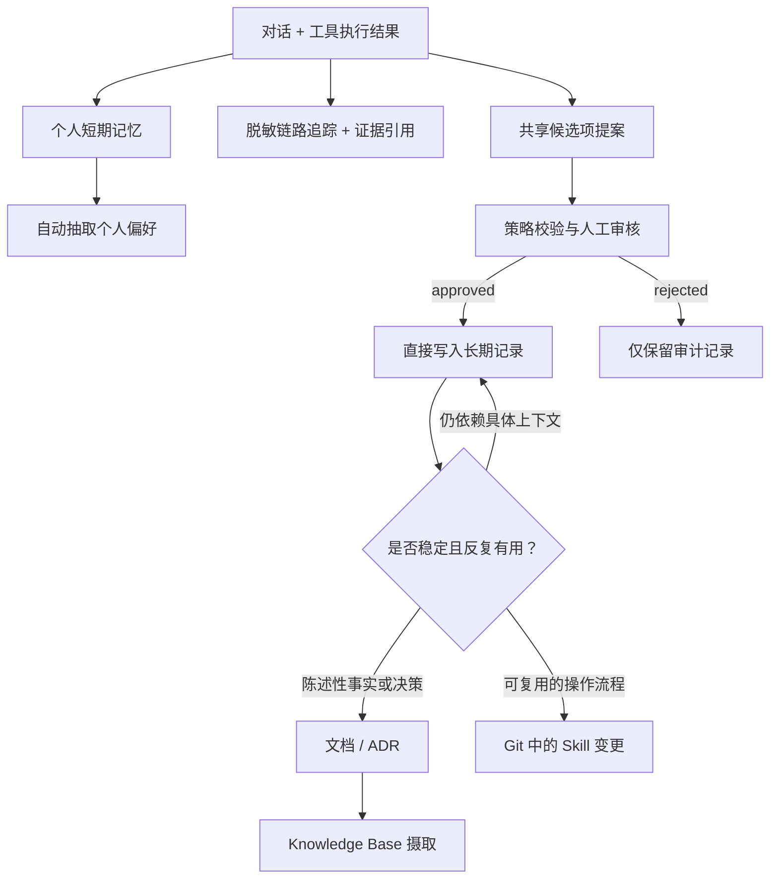

# 架构与知识边界

> 本文档为主版本。English: [architecture.md](architecture.md)。

## 设计目标

- 支持多用户项目，且个人偏好彼此隔离。
- 共享记忆只有在通过审核后才对全体项目成员可见。
- 不允许直接从原始日志中检索。
- 每条共享记录都可追溯到证据来源和审批人。
- 稳定下来的知识可以晋升为托管文档或带版本的 Skills。
- 运行时检索遵循一套确定性的优先级策略。

## 身份模型

| 作用域 | 资源 | Actor ID | Session ID | 命名空间 |
|---|---|---|---|---|
| 个人对话 | Personal Memory | `user:<subject>` | 对话 ID | 短期事件作用域 |
| 个人偏好 | Personal Memory | `user:<subject>` | 来源对话 | `/users/{actorId}/preferences/` |
| 会话摘要 | Personal Memory | `user:<subject>` | 对话 ID | `/users/{actorId}/sessions/{sessionId}/summary/` |
| 项目共享知识 | Shared Memory | 合成的项目归属标识 | 不适用于直接写入的记录 | `/projects/project:<project_id>/shared/` |

应用从不可变的 Cognito `sub` 声明推导出 `subject`，并从已认证的声明中推导项目成员
身份。客户端永远不能自行指定任意的 actor ID 或项目命名空间。合成的
`project:<project_id>` 片段只是直接写入长期记录时的一种组织约定，它并不是一个安全
主体（security principal）。

## 知识分层

| 层级 | 用途 | 权威性 | 智能体是否直接检索 |
|---|---|---|---|
| 日志与链路追踪 | 证据、排障、评估 | 观测性数据 | 否 |
| 短期记忆 | 对话连续性 | 原始交互 | 仅当前会话 |
| 个人长期记忆 | 用户偏好 | 用户级作用域，抽取得到 | 是，仅限该用户本人 |
| 共享长期记忆 | 经审核的项目经验 | 项目级作用域，已审核 | 是，面向项目成员 |
| 托管 Knowledge Base | 权威文档与持久事实 | 文档所有者 | 是 |
| 团队 Skills | 可执行流程与工具策略 | Git 评审与测试 | 由触发条件加载 |

Knowledge Base 承载权威文档检索；Skills 承载带版本管理的运行行为。共享记忆保存
有价值、已审核，但尚未沉淀为文档或 Skill 的经验。

## 信息生命周期

晋升会创建一个新的、有明确归属的制品，不复制原始对话。新制品附带来源引用、审核人、
生效日期和生命周期。

## 运行时检索策略

数据分析智能体按以下顺序构建上下文：

1. 实时 API、当前数据集和工具执行结果。
2. 团队 Skills 以及 Git 中的代码/配置。
3. 托管 Knowledge Base 文档。
4. 已审批的项目共享记忆。
5. 个人偏好记忆。
6. 模型自身推理。

高优先级层会覆盖与之冲突的低优先级层。记忆绝不允许覆盖当前数据或权威文档。

## 审核策略

一个候选项必须包含：

- 项目 ID 和候选项 ID；
- 简洁、可独立理解的陈述；
- 类别：`fact`、`decision`、`constraint`、`incident` 或 `procedure_hint`；
- 指向某条链路追踪或不可变日志记录的证据引用；
- 提案人用户 ID；
- 置信度与隐私分级；
- 若信息是临时性的，还需给出建议的过期日期。

包含原始凭证、受限数据或直接个人信息的候选项，会在进入人工审核之前被拒绝。审批通过
时会以 `requestIdentifier=candidate_id` 调用 `BatchCreateMemoryRecords`。这样可以原样
存储已审核的陈述、避免二次模型抽取，并返回长期记录的 `memoryRecordId` 供审计记录使用。
直接写入的记录在检索侧是最终一致的。

共享 Memory 资源为 `project_id`、`category`、`review_status` 和 `promotion_hint` 声明了
不可变的索引键。运行时检索同时使用精确的项目命名空间，以及针对 `project_id` 和
`review_status=approved` 的元数据过滤条件。`candidate_id` 保持为非索引元数据，用于把
记录关联到 DynamoDB 中包含证据和审核人身份的审计条目。

## 权限

| 角色 | Personal Memory | Shared Memory | 候选项表 | 任务令牌 |
|---|---|---|---|---|
| 智能体运行时 | 仅读写自身 actor | 仅检索 | 通过 EventBridge 提案 | 无 |
| 审核工作流 | 无 | 无 | 读写工作流状态 | 创建回调 |
| 审核人 API | 无 | 无 | 仅限项目审核人组 | 一次性消费 |
| 共享记忆发布器 | 无 | 单一项目命名空间内的 `BatchCreateMemoryRecords` | 读取已审批候选项 | 无 |
| 运维 | 应急通道（break-glass）/留审计 | 应急通道/留审计 | 留审计的读取 | 无 |

堆栈对共享记忆的发布和检索权限施加了精确匹配的 `bedrock-agentcore:namespace` 条件。
个人记忆的隔离还需要在部署时做一个身份方案决策：

- 由可信的服务端运行时推导 Cognito `sub`，并在应用代码中强制校验 actor 归属；或者
- 使用 Cognito Identity Pool 凭证，把每个调用方绑定到与其身份相关的 IAM 条件上，
  这能提供最强的用户级边界。

面向生产环境，还应补充项目成员授权、日志数据保护、留存策略，以及开发与生产使用独立
的 AWS 账号。

演示只创建了一个项目专属的 Cognito 组。在组织级规模下，应把企业 IdP 的项目声明映射
到同一套授权检查逻辑，而不是自行管理本地 Cognito 用户。

回调记录会在 `WAITING`、`DECIDING` 和 `CONSUMED` 之间流转。当回调投递遇到语义不明确的
网络故障时，`DECIDING` 状态会被刻意保留。生产环境应由一个运维作业将该状态与 Step
Functions 的执行历史做对账，而不是自动重放一次性令牌。

## 日志规范

- 链路追踪属性可能包含提示词/响应内容，因此应按敏感数据对待。
- 不要把原始对话、任务令牌、凭证或 PII 放进 EventBridge。
- 事件元数据不是存放敏感数据的地方。
- 记录元数据同样不适合存放密钥或原始证据。
- 把 `evidence_ref`、哈希值和标识符放在工作流负载中。
- 保持 Step Functions 执行负载体积小且不含敏感信息。
- 使用带关联 ID（correlation ID）的结构化日志，并设置有限的留存期。
